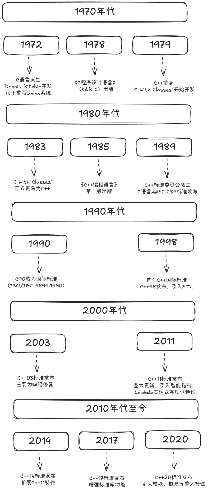

# C 与 C++ 学习路线

C 和 C++ 都能直接表达内存、数据布局与系统接口，因此常见于操作系统、嵌入式、
高性能程序和 CTF 二进制题。本目录以 **C17** 与 **C++17** 为基线：示例分别使用
符合 ISO C17、ISO C++17 的编译选项，不依赖编译器私有扩展。



## 两门语言的关系

C 与 C++ 有共同的历史和大量相似语法，但它们是两门独立语言：

| 方面 | C17 | C++17 |
| --- | --- | --- |
| 主要抽象 | 函数、结构体、模块化接口 | 类、模板、泛型、RAII、多范式 |
| 字符串 | 以 `\0` 结尾的字符数组 | `std::string`，也可使用 C 字符串 |
| 动态内存 | `malloc` / `free` | 容器、智能指针，必要时 `new` / `delete` |
| 错误处理 | 返回值、错误码、`errno` | 同左，也可使用异常 |
| 泛型能力 | 宏、`void *`、约定 | 模板与标准库算法 |

“C++ 是 C 的严格超集”并不准确。某些合法 C 程序不是合法 C++ 程序，两门语言对
类型转换、关键字、初始化和标准库的规则也不同。`.c` 应由 C 编译器处理，`.cpp`
应由 C++ 编译器处理。

## 阅读顺序

1. [环境与构建](environment-and-build.md)：安装编译器，理解编译、链接与调试。
2. [C 语言基础](c-language-basics.md)：类型、表达式、控制流、数组、字符串和结构体。
3. [C++ 语言基础](cpp-language-basics.md)：引用、初始化、类型推导、字符串与容器。
4. [函数与程序结构](functions-and-program-structure.md)：参数、作用域、头文件和多文件构建。
5. [指针、内存与生命周期](pointers-memory-and-lifetime.md)：地址、所有权、动态内存和未定义行为。
6. [C++ OOP、STL 与 RAII](cpp-oop-stl-and-raii.md)：类、继承、模板、容器和资源管理。
7. [C/C++ 安全与 CTF](c-cpp-security-and-ctf.md)：安全审计、加固、调试与二进制基础。

初学者应按顺序阅读。已有编程经验的读者可以从指针章节开始查漏补缺，但安全篇依赖
前面对整数转换、数组边界、对象生命周期和链接过程的理解。

## 第一个 C 程序

```c
#include <stdio.h>
int main(void) {
    puts("Hello, C17!");
    return 0;
}
```

```bash
cc -std=c17 -Wall -Wextra -Wpedantic hello.c -o hello
./hello
```

`main` 返回 `0` 表示成功。`puts` 在字符串后自动输出换行。

## 第一个 C++ 程序
```cpp
#include <iostream>

int main() {
    std::cout << "Hello, C++17!\n";
    return 0;
}
```

```bash
c++ -std=c++17 -Wall -Wextra -Wpedantic hello.cpp -o hello
./hello
```

教程示例通常显式写 `std::`，而不在头文件或全局作用域使用
`using namespace std;`，这样能避免名称冲突并让名称来源更清楚。

## 必须建立的心智模型

### 类型不是大小的别名

标准只规定许多整数类型的最小范围和相对关系，不保证 `int` 永远是 4 字节，
也不保证 `long` 在所有 64 位系统上都是 8 字节。需要固定宽度时使用
`<stdint.h>` 的 `int32_t`、`uint64_t` 等类型，并先确认实现提供该类型。

### 作用域不等于生命周期
作用域描述“名字在哪里可见”，存储期或生命周期描述“对象何时存在”。局部
`static` 变量的名字只在函数内可见，但对象从首次初始化后一直存在到程序结束。

### 编译成功不代表行为正确

C/C++ 中有三类需要区分的结果：

- **良定义行为**：标准明确规定结果。
- **实现定义行为**：实现必须选择并记录一种结果，例如普通 `char` 的符号性。
- **未定义行为（UB）**：标准不施加要求，例如越界访问、使用已释放对象。

优化器可以假设程序没有 UB，因此“调试版似乎能运行”不是正确性的证据。

### 资源必须有明确所有者

资源不只包括堆内存，也包括文件、锁、套接字和系统句柄。C 中通过约定和统一清理
路径管理资源；C++ 中优先让对象析构函数自动释放资源，即 RAII。

## 推荐练习方式

- 每个示例都亲自编译，开启全部常用警告。
- 修改输入边界，观察空输入、最大值、负数和非法字符。
- 用调试器查看变量、调用栈、地址和内存。
- 用 AddressSanitizer 与 UndefinedBehaviorSanitizer 检查练习程序。
- 同一小程序分别用 C17 与 C++17 实现，比较接口和所有权表达方式。

## CTF 学习边界

CTF 会要求读者识别栈、堆、调用约定、整数表示、ELF/PE 和常见内存错误。本目录只
讲教育性原理、审计方法、安全实验和防护，不提供可直接用于未授权目标的攻击自动化。
所有练习都应在自己编译的程序、赛事附件或明确授权的环境中完成。

## 速查编译命令

```bash
# C17 调试构建
cc -std=c17 -O0 -g3 -Wall -Wextra -Wpedantic demo.c -o demo
# C++17 调试构建
c++ -std=c++17 -O0 -g3 -Wall -Wextra -Wpedantic demo.cpp -o demo
# GCC/Clang 常见动态检查
cc -std=c17 -O1 -g -fsanitize=address,undefined demo.c -o demo
c++ -std=c++17 -O1 -g -fsanitize=address,undefined demo.cpp -o demo
```

不同平台的完整命令、MSVC 对应选项及构建系统用法见
[环境与构建](environment-and-build.md)。

## 学完后的目标

完成本系列后，应能做到：

- 独立编译和调试小型 C/C++ 多文件程序。
- 准确解释整数、数组、指针、引用、对象和生命周期。
- 使用 C++ 容器与 RAII 编写不依赖手工资源释放的代码。
- 识别越界、溢出、悬空指针、格式化字符串等高风险模式。
- 阅读基础反汇编，并把机器级现象映射回源代码和 ABI 概念。

下一篇：[环境与构建](environment-and-build.md)。
