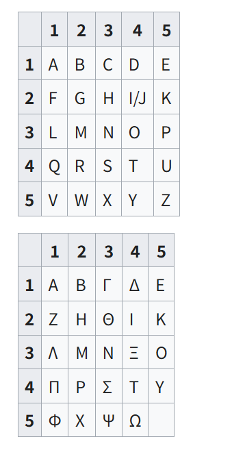

> 波利比奥斯（波利比乌斯）发明了一种在电报中非常有用的工具，它允许使用一种名为“波利比乌斯方阵”的数字系统轻松地传递字母信号，该方阵在《历史》第十卷第45章第6节及后续章节中有所提及。[ 21 ]这一原理也适用于密码学和隐写术。现代的波利比乌斯方阵实现方式，至少在英语、西班牙语、法语、德语和意大利语等西欧语言中，通常使用这些语言所使用的罗马字母。然而，波利比乌斯本人使用的是希腊语，因此他很可能是用希腊字母来实现他的密码方阵的。此处展示了两种版本。

波利比奥斯（波利比乌斯）方阵密码是一种 **二维表替换密码**：

1. 创建一个 5x5 的字母方阵（25 个格子），通常把 I 和 J 合并为一个格子。
2. 每个字母用它所在的 **行号+列号** 表示。
3. 加密：将每个字母替换为对应的坐标数字。
4. 解密：将坐标数字映射回字母。



A → 11 （第1行第1列）

B → 12 （第1行第2列）

I/J → 24 （第2行第4列）

Z → 55 （第5行第5列）

# 加密逻辑

**目标**：将明文转换为数字坐标（行列表示）。

**步骤**：

1. **准备方阵**
    创建一个 5×5 的字母表格，把字母按顺序填进去，I/J 合并为一个格子：

   ```
       1 2 3 4 5
    1: A B C D E
    2: F G H I K
    3: L M N O P
    4: Q R S T U
    5: V W X Y Z
   ```

2. **处理明文**

   - 转大写
   - 将 `J` 替换为 `I`
   - 保留非字母字符（可选）

3. **查找字母坐标**
    对明文中的每个字母：

   - 找到它在方阵中的行号和列号
   - 将行号 + 列号 拼接为两位数字

4. **生成密文**

   - 按顺序把每个字母的坐标组合起来
   - 非字母字符可以原样保留

**示例**：

```
明文: HELLO
H → (2,3) → 23
E → (1,5) → 15
L → (3,1) → 31
L → (3,1) → 31
O → (3,4) → 34
密文: 23 15 31 31 34
```

------

# 解密逻辑

**目标**：将数字坐标转换回明文字母。

**步骤**：

1. **准备方阵**
    与加密时相同。
2. **分组数字**
   - 每两个数字表示一个字母的行号和列号
   - 非数字字符直接保留
3. **查找字母**
   - 用行号-1、列号-1 作为索引取出方阵对应字母
4. **拼接明文**
   - 将所有字母按顺序组合起来
   - 得到原文

**示例**：

```
密文: 23 15 31 31 34
23 → 行2列3 → H
15 → 行1列5 → E
31 → 行3列1 → L
31 → 行3列1 → L
34 → 行3列4 → O
明文: HELLO
```