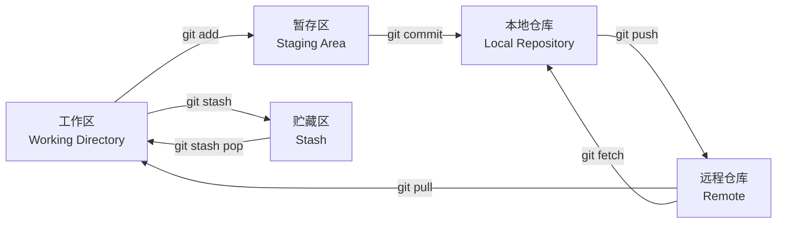

# Git 工作流程

本章节介绍 Git 的基本工作流程。

Git 的日常使用可以理解为：修改代码、选择要提交的改动、提交到本地历史、推送到远程仓库。

## 工作流程图



我们可以把 Git 的工作流程想象成一个写作业并交给老师的过程。结合上面的图，可以把这个流程分为四个主要部分。

## 1. 工作区 Working Directory

工作区就像你的书桌，是你实际修改文件的地方。你在这里写代码、删除文件、修改配置、修复 Bug。

常见动作：

```bash
git status
```

`git status` 可以查看当前哪些文件被修改、哪些文件还没有暂存。

## 2. 暂存区 Staging Area

暂存区就像你的待邮寄篮子。当你觉得作业写得差不多了，会把它放进篮子里，准备打包。

关键指令：

```bash
git add filename
git add .
```

意义：告诉 Git，这些改动我确认要提交了，先帮我记着。

暂存区的好处是可以选择性提交。例如你同时修改了登录功能和文档，可以只把登录功能相关文件放入暂存区，先提交一条清晰的历史。

## 3. 本地仓库 Local Repository

本地仓库就像你的个人保险箱。你把篮子里的东西打包好，贴上标签，也就是提交信息，然后锁进自己的保险箱。

关键指令：

```bash
git commit -m "Add new feature"
```

意义：改动正式成为项目历史的一部分。即便你之后改乱了，也可以从这里找回。

## 4. 远程仓库 Remote

远程仓库就像老师的收件箱，例如 GitHub、GitLab、Gitee 上的仓库。你把本地提交通过网络发送给远程服务器，方便其他人查看或合作。

关键指令：

```bash
git push origin new-feature
```

意义：备份代码，并与团队共享进度。

## 知识点说明

### git stash 贮藏区

作业写了一半，突然要改另一个急活，但又不想把没写完的作业提交。这时可以先用 `stash` 把代码藏进抽屉，等忙完再拿出来继续写。

```bash
git stash
git stash pop
```

### git pull 拉取

`git pull` 表示看看远程仓库有没有别人提交的新内容，并直接同步到你的当前分支。

```bash
git pull origin main
```

它通常等价于：

```bash
git fetch origin
git merge origin/main
```

### git fetch 与 git merge

`git fetch` 是先看看远程有什么更新，但不立刻合并到当前代码。

```bash
git fetch origin
```

确认没问题后，再合并到自己的代码里：

```bash
git merge origin/main
```

## 简单总结

```text
修改代码 -> add 放进篮子 -> commit 存入箱子 -> push 寄给远方
```

## 命令说明

### 1. 克隆仓库

如果要参与一个已有项目，首先需要将远程仓库克隆到本地：

```bash
git clone https://github.com/username/repo.git
cd repo
```

### 2. 创建新分支

为了避免直接在 `main` 或 `master` 分支上开发，通常会创建一个新的分支：

```bash
git checkout -b new-feature
```

也可以使用较新的命令：

```bash
git switch -c new-feature
```

### 3. 工作目录

在工作目录中进行代码编辑、添加新文件或删除不需要的文件。

查看当前状态：

```bash
git status
```

### 4. 暂存文件

将修改过的文件添加到暂存区，以便进行下一步提交操作：

```bash
git add filename
```

添加所有修改的文件：

```bash
git add .
```

### 5. 提交更改

将暂存区的更改提交到本地仓库，并添加提交信息：

```bash
git commit -m "Add new feature"
```

### 6. 拉取最新更改

在推送本地更改之前，最好从远程仓库拉取最新更改，以避免冲突：

```bash
git pull origin main
```

如果在新的分支上工作：

```bash
git pull origin new-feature
```

### 7. 推送更改

将本地提交推送到远程仓库：

```bash
git push origin new-feature
```

### 8. 创建 Pull Request

在 GitHub 或其它托管平台上创建 Pull Request，邀请团队成员进行代码审查。PR 合并后，你的更改就会合并到主分支。

### 9. 合并更改

在 PR 审核通过并合并后，可以将远程仓库的主分支合并到本地分支：

```bash
git checkout main
git pull origin main
git merge new-feature
```

### 10. 删除分支

如果不再需要新功能分支，可以将其删除：

```bash
git branch -d new-feature
```

从远程仓库删除分支：

```bash
git push origin --delete new-feature
```

## 推荐日常流程

```bash
git switch main
git pull origin main
git switch -c feature/login
# 修改代码
git status
git add .
git commit -m "Add login feature"
git push origin feature/login
```

然后到 GitHub 或 GitLab 创建 PR/MR，等待审核合并。
