# Solar 应急响应靶场训练合集

> 本页面整理自“思而听-Solar 应急响应靶场训练合集”，用于索引应急响应、日志分析、流量研判和授权安全实验环境。原合集持续更新，训练环境和下载地址请以发布方页面的最新信息为准。

!!! warning "仅限授权环境"

    以下环境只适用于 CTF 比赛、课程实验、本地靶场和经过明确授权的安全测试。不要对不属于自己的主机、账号、网络或业务系统进行扫描、利用、登录或数据提取。下载镜像后建议在隔离网络中运行，并在练习结束后清理环境。

## 合集简介

这些训练环境通过模拟勒索病毒、挖矿木马、Web 入侵、账号失陷、数据泄露、横向移动和恶意软件感染等事件，帮助学习者练习完整的应急响应流程：

- 识别异常主机、进程、账号、文件和网络连接。
- 结合 Windows、Linux、Web、中间件和数据库日志还原攻击时间线。
- 使用 Wireshark、ZUI、系统日志工具和主机排查工具分析证据。
- 定位漏洞入口、恶意文件、持久化机制和横向移动痕迹。
- 编写应急响应报告，并根据根因完成安全加固。

每个训练环境一般包含环境简介、访问方式、相关技术文章和练习重点。访问地址、账号密码和下载链接仅供对应授权靶场使用，不应直接用于真实业务系统。

## 训练环境索引

| 编号 | 训练主题 | 主要能力 |
| --- | --- | --- |
| 1 | 勒索病毒应急响应与溯源 | Windows 日志、勒索识别、攻击链还原、数据恢复 |
| 2 | Linux 特洛伊挖矿木马 | 进程与网络排查、系统完整性、供应链投毒 |
| 3 | 学校挖矿病毒与流量分析 | Web 入侵、流量分析、Linux 持久化 |
| 4 | 医院脱库与安全加固 | 源码泄露、账号复用、SQL 注入、报告编写 |
| 5 | Windows 应急响应综合研判 | RDP、Web 日志、Windows 日志、流量还原 |
| 6 | 三层内网综合渗透 | DMZ、横向移动、多级代理、内网分析 |
| 7 | 蓝队攻击流量研判 | 漏洞利用、爆破、扫描器、WebShell 流量 |
| 8 | Windows 日志分析专项 | RDP 爆破、隐藏账号、持久化、恶意进程 |
| 9 | 行业攻防演练应急响应 | Actuator 泄露、Shiro 攻击、权限维持、溯源 |
| 10 | Phobos 勒索病毒钓鱼与解密 | 邮件分析、样本分析、解密和备份恢复 |
| 11 | DMZ 区 Windows/Linux 联动排查 | WebShell、Defender、内网移动、账户加固 |
| 12 | 恶意浏览器插件窃密与远控溯源 | 浏览器取证、插件分析、窃密行为、C2 溯源 |

## 一、勒索病毒应急响应与溯源

### 环境简介

该环境模拟 Windows Server 2016 上的勒索病毒攻击场景。对外开放的“若依”管理系统运行在 `12333` 端口，攻击者利用 Shiro 反序列化漏洞获得服务器权限，随后通过 PowerShell 关闭 Windows Defender，上传 C2 木马和 Live 家族勒索病毒 `systime.exe`，最后执行加密器导致服务器文件被加密。

练习重点包括：

- 识别勒索病毒家族并尝试恢复数据。
- 定位 Shiro 漏洞利用、C2 木马和加密器。
- 分析 Windows 日志和系统文件。
- 使用 EventLogView、Everything 等工具辅助排查。

### 访问与资料

- 在线环境：访问 [青少年 CTF](https://www.qsnctf.com/)，在平台内搜索“勒索”。
- 离线环境（夸克网盘）：[下载环境](https://pan.quark.cn/s/9263f5886cab)。
- 离线环境（百度网盘）：[下载环境](https://pan.baidu.com/s/1HNErGe5LuxLNC8S3XiLFMQ?pwd=vj3t)。
- 相关文章：[2025 年勒索病毒排查溯源指南](https://mp.weixin.qq.com/s/P0x6W7QhhPToJod8v-QI0g)、[勒索溯源排查训练](https://mp.weixin.qq.com/s/1RgNzrEmNc6urisdmKEjPg)。

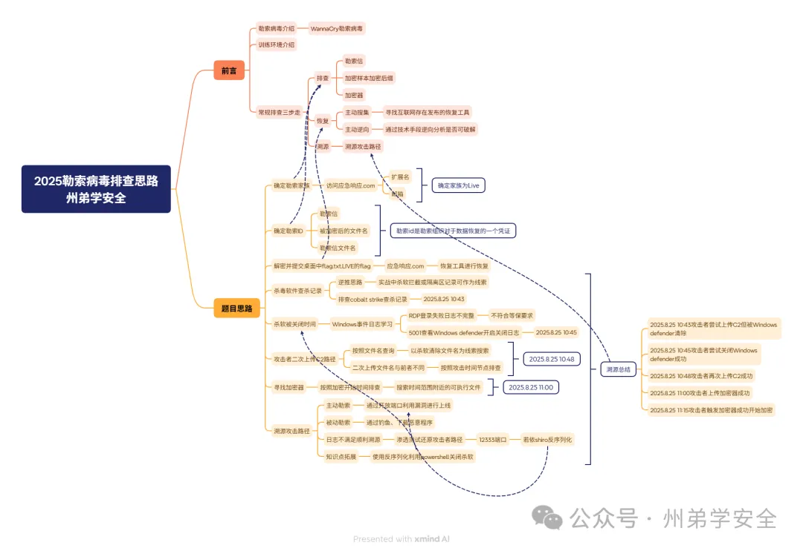

## 二、Linux 特洛伊挖矿木马排查

### 环境简介

该环境模拟 Ubuntu 22.04 服务器感染挖矿木马的事件。运维人员从非官方渠道下载了被植入后门的 `superlog` 工具并执行。后门程序 `setup` 感染 `ls`、`ps`、`top`、`stat` 等系统指令，释放挖矿程序 `/tmp/kworkerds`，并创建守护脚本 `/usr/bin/.0guardian` 和定时任务 `/etc/cron.d/0guardian`。

练习重点包括：

- 使用 `top`、`lsof`、`ss` 等命令定位挖矿进程、文件和矿池地址。
- 分析 `cron` 定时任务与受感染系统文件组成的持久化机制。
- 结合内部聊天记录定位供应链投毒来源。
- 在断网环境下使用 `dpkg` 恢复系统文件完整性。

### 访问与资料

- 在线环境：进入 [青少年 CTF 靶场](https://www.qsnctf.com/)。
- 离线环境（百度网盘）：[下载环境](https://pan.baidu.com/s/1Zjghkg55-USdDiWKgnJ7Dw?pwd=zhou)。
- 离线环境（夸克网盘）：[下载环境](https://pan.quark.cn/s/a2c2454a196c)。
- 相关文章：[特洛伊挖矿木马事件排查](https://mp.weixin.qq.com/s/HSxn6nJWNtMr1w6kTXwu-g)、[特洛伊挖矿木马靶场复现](https://mp.weixin.qq.com/s/cMj5vZqF4hBSeMSmqpSqZw)。

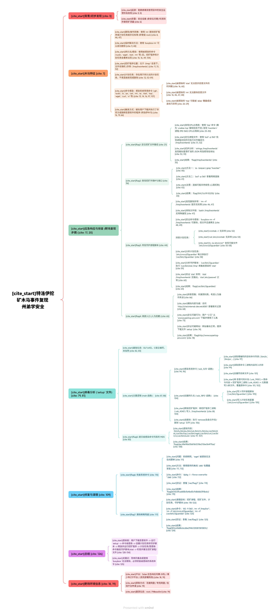

## 三、学校挖矿病毒应急响应与流量分析

### 环境简介

该环境模拟 Ubuntu 22.04 上的 Tomcat 管理系统遭遇挖矿攻击。系统对外开放 Web 服务 `19999` 端口和 SSH `2222` 端口。攻击者注册普通用户 `wangyunqing` 后，利用 `/servlet/user/uploadAvatar` 任意文件上传漏洞上传 JSP WebShell，进而控制服务器。

攻击者随后运行 `/tmp/miner.jar`，造成 CPU 占用率异常升高，并通过 `/usr/share/.per/persistence.sh` 和 `/usr/share/.miner/miner.jar` 创建能够自动恢复的挖矿持久化机制。

练习重点包括：

- 使用 Wireshark 或 ZUI 分析 `.pcap` 流量，并结合 Web 日志还原文件上传攻击路径。
- 排查高 CPU 占用的 Java 挖矿进程。
- 分析 `crontab` 和隐藏目录中的持久化脚本。
- 综合使用 `find`、`top`、`ps` 和 `crontab -l` 等命令完成主机排查。

### 访问与资料

- 离线环境：[腾讯文档](https://docs.qq.com/doc/DVkNMaVhUTXpnekpa)。
- SSH：`root/edusec123`，端口 `2222`。
- Web：端口 `19999`。
- 相关文章：[某学校系统中挖矿病毒的超详细排查思路](https://mp.weixin.qq.com/s/xIh4NukshMVEIuQzuu4rbw)。

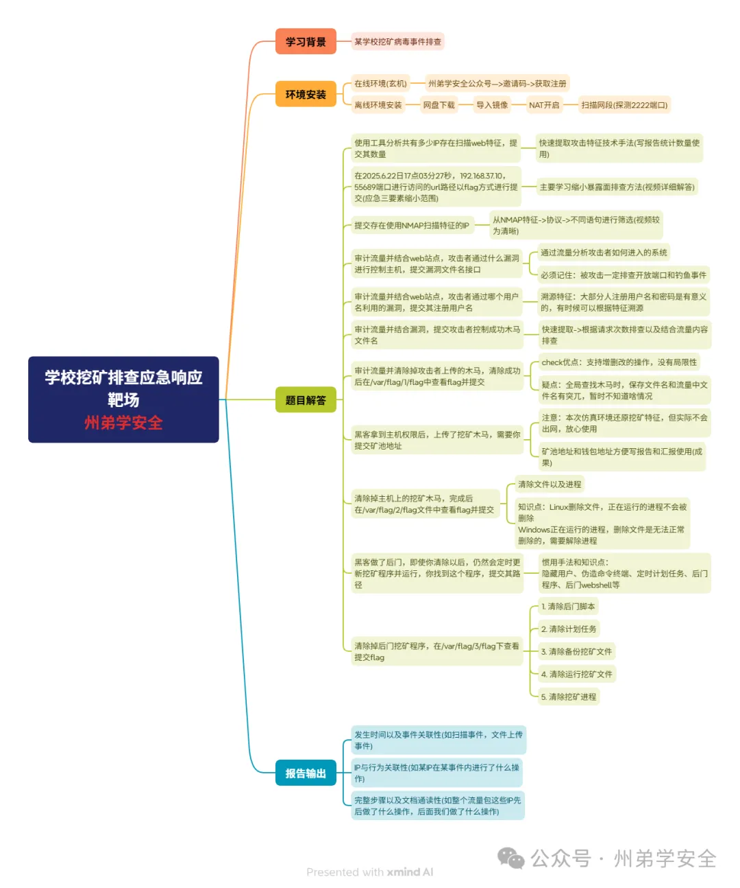

## 四、医院脱库应急响应与安全加固

### 环境简介

该环境模拟 Windows Server 2019、PHPStudy 环境中的医院管理系统发生数据泄露。攻击者首先从 Gitee 发现泄露的系统源代码，获得数据库连接密码 `zhoudi123` 和默认后台账号 `admin`；随后利用密码复用登录后台，并通过 `/admin/settings.php` 的“用户查询”功能触发 SQL 注入，读取 `patients` 患者信息表。

流量中还包含端口扫描、AWVS 扫描、Web 爆破和批量注册垃圾用户等行为痕迹。

练习重点包括：

- 使用 Wireshark、ZUI 区分扫描、爆破、注入和批量注册行为。
- 结合 Gitee 源码泄露分析后台权限获取过程。
- 定位 SQL 注入点并分析数据读取行为。
- 使用预处理语句修复代码，轮换泄露凭据并完成安全加固。
- 撰写完整的应急响应报告。

### 访问与资料

- 离线环境：[123 网盘](https://www.123684.com/s/oJnajv-EzWnh)。
- 登录账号：`administrator/Zhoudi666`。
- 相关文章：[某医院系统被脱库：从溯源到报告输出](https://mp.weixin.qq.com/s/QmBXMJ9juDKxD19iVlj95g)。

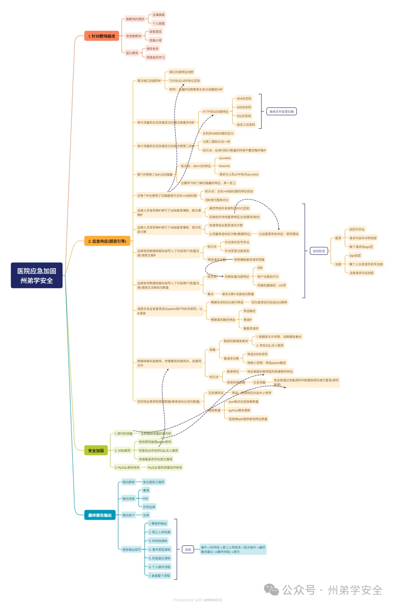

## 五、Windows 应急响应综合研判

### 环境简介

该环境模拟 Windows Server 2019、PHPStudy、Nginx 和 DedeCMS 组成的综合攻击场景。攻击者 `192.168.18.133` 对 DedeCMS 进行登录爆破，并尝试利用后台文件上传漏洞写入 `newfile1.php`；另一攻击者 `192.168.18.1` 通过 3389 端口成功登录远程桌面。

练习重点包括：

- 使用 `netstat -ano` 检查开放端口。
- 使用 FullEventLogView 分析 Windows 安全日志，重点关注事件 ID `4625`、`4624`。
- 使用 `awk` 分析 Nginx `access.log`，识别目录扫描、爆破和漏洞利用。
- 使用 Wireshark、ZUI 分析 `.pcap` 流量，还原 DedeCMS 利用与 RDP 登录过程。

### 访问与资料

- 离线环境（夸克网盘）：[下载环境](https://pan.quark.cn/s/7b67f6737eae)。
- 登录账号：`administrator/P@ssw0rd`。
- 相关文章：[Windows 应急响应研判思路](https://mp.weixin.qq.com/s/k7VwLpn3XGMjobhUAZF22A)。

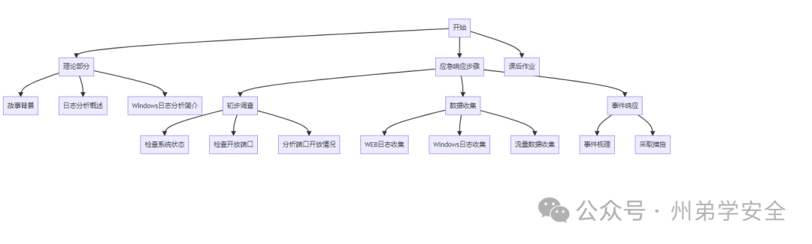

## 六、三层内网综合渗透

### 环境简介

该环境包含 DMZ 区、二层网络和三层网络：

- DMZ：Windows Server，运行 DedeCMS 和 FTP。
- Layer 2：Linux，运行 Nginx、Redis 和 Nacos。
- Layer 3：Windows 7，存在 MS17-010 漏洞。

场景中的攻击链包括：通过 FTP 泄露获取 DedeCMS 源码并利用文件上传漏洞获得 WebShell；从 DMZ 扫描二层网络，利用 Nacos 未授权访问、Redis 配置和 FRP 代理控制二层主机；再通过二级代理链分析三层网络中的 MS17-010 风险。

练习重点包括：

- DedeCMS 文件上传、Nacos 未授权、Redis 写入和 MS17-010 等漏洞的防守侧分析。
- FRP、Proxychains、Proxifier 等多级代理的识别与排查。
- 跨网段扫描、代码审计和横向移动痕迹分析。

### 访问与资料

- 离线环境（夸克网盘）：[下载主环境](https://pan.quark.cn/s/9de384312d0f)。
- DMZ：`administrator/P@ssw0rd1`。
- Layer 2：`dmz/P@ssw0rd2`。
- Layer 3：`pro/P@ssw0rd3`。
- 相关文章：[三层网络渗透及综合渗透概念](https://mp.weixin.qq.com/s/dYIukeFpgz68ih10uF_Eow)。

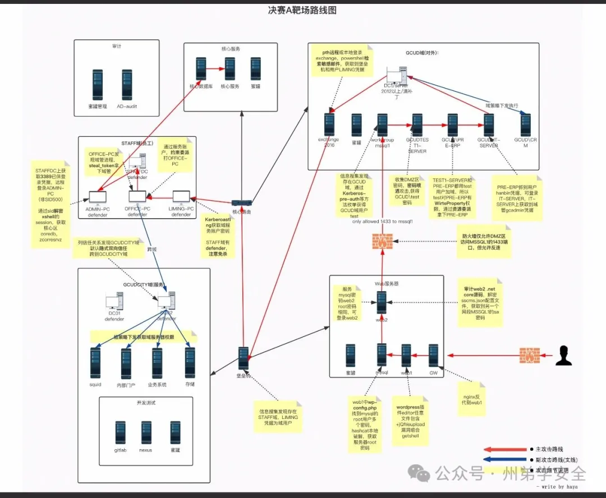

## 七、蓝队攻击流量研判

### 环境简介

该专题提供一组真实或模拟的 `.pcap` 流量包及分析思路，重点训练蓝队成员识别常见攻击行为，而不是针对某一台固定靶机进行利用。

覆盖内容包括：

- SQL 注入、XSS、XXE、命令执行和任意文件上传等漏洞利用流量。
- 区分暴力破解与密码喷洒的登录行为模式。
- 识别 AWVS、Goby、Xray 和专项漏洞扫描器的流量特征。
- 分析冰蝎、哥斯拉、蚁剑等 WebShell 工具的连接、心跳和命令执行流量。
- 识别 SYN Flood、ARP 欺骗等其他攻击流量。
- 结合日志和流量中的 URL、方法、请求头、请求体、状态码、频率、UA 和特殊字符串判断攻击或误报。

### 访问与资料

- 流量包（夸克网盘）：[下载流量包](https://pan.quark.cn/s/a34f767dbc8e)，提取码：`F3rJ`。
- 流量包（百度网盘）：[下载流量包](https://pan.baidu.com/s/1J2S06vkMiW7N5_VFAG0x9A?pwd=lp5e)。
- 相关文章：[攻击流量事件研判计划](https://mp.weixin.qq.com/s/h6B611dKZoziDivQbYNTqg)、[常规漏洞流量分析](https://mp.weixin.qq.com/s/jWoUm6f14nlW__3e6K5EbQ)、[远控工具及 WebShell 流量分析](https://mp.weixin.qq.com/s/BoS3eNyC7Vn7phkTRpg2og)。

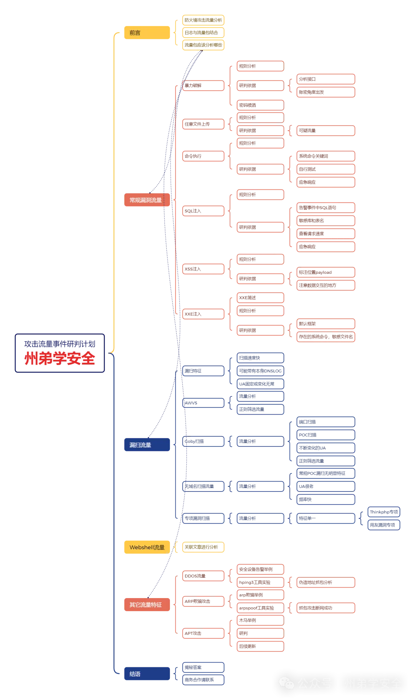

## 八、Windows 日志分析专项

### 环境简介

该环境模拟 Windows 7 服务器遭受 RDP 爆破后的应急响应场景。攻击者爆破登录 `winlog` 账户后，创建隐藏账户 `hacker$` 和 `hackers$`，植入疑似 CobaltStrike 或 Meterpreter 的远控程序 `xiaowei.exe`，并通过注册表 Run 键和计划任务 `download.bat` 建立持久化。Nginx `access.log` 中还记录了来自其他 IP 的扫描行为。

练习重点包括：

- 使用 `awk` 分析 Nginx 日志并识别 Web 扫描。
- 使用事件 ID `4625` 统计 RDP 登录失败，使用 `4624` 和 `4648` 追踪成功登录。
- 使用 `net user`、`lusrmgr.msc`、注册表和 D 盾排查隐藏账户。
- 检查注册表启动项和计划任务，定位 `xiaowei.exe`、`download.bat` 等持久化文件。
- 使用 `netstat -nao`、`tasklist` 和 WMI 命令关联恶意进程与 C2 连接。

### 访问与资料

- 离线环境（天翼网盘）：[下载环境](https://cloud.189.cn/t/jQJbeu6ZBBzq)，访问码：`il8x`。
- 登录账号：`winlog/winlog123`。
- 相关文章：[Windows 日志分析实战](https://mp.weixin.qq.com/s/eJpsOeaEczcPE-uipP7vCQ)。

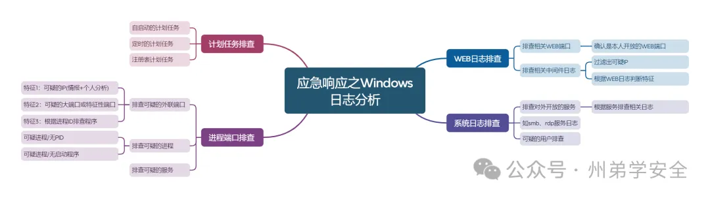

## 九、行业攻防演练应急响应

### 环境简介

该环境模拟 Ubuntu 22.04 上基于若依框架的 Spring Boot 应用遭遇多阶段攻击。系统开放 SSH `22` 端口、Actuator `9988` 端口和主应用 `12333` 端口。

攻击过程包括：使用 Nmap、AWVS 进行信息收集；利用 Actuator `/heapdump` 泄露内存信息，从中提取 Shiro 密钥和弱口令；利用 Shiro 反序列化漏洞完成命令执行和反弹 Shell；之后使用改名的 fscan 扫描内网，并通过 `cron`、systemd 服务和 SSH 公钥建立权限维持。

练习重点包括：

- 使用 Wireshark 分析 Nmap、AWVS、Shiro 攻击、DNSLog 和反弹 Shell 流量。
- 排查 Actuator 泄露、`cron`、systemd 和 SSH `authorized_keys`。
- 使用文件哈希和日志定位改名的扫描工具。
- 梳理攻击时间线、攻击者 IP 与行为，输出应急响应报告。

### 访问与资料

- 离线环境（夸克网盘）：[下载环境](https://pan.quark.cn/s/e3de421439d4)。
- 登录账号：`root/security123`。
- 应急主机 IP：`192.168.0.211`。
- 流量包路径：`/home/security/security.pcap`。
- 相关文章：[行业攻防应急响应实战](https://mp.weixin.qq.com/s/2eYZGnDaD6M0sdrIVPhbhQ)。

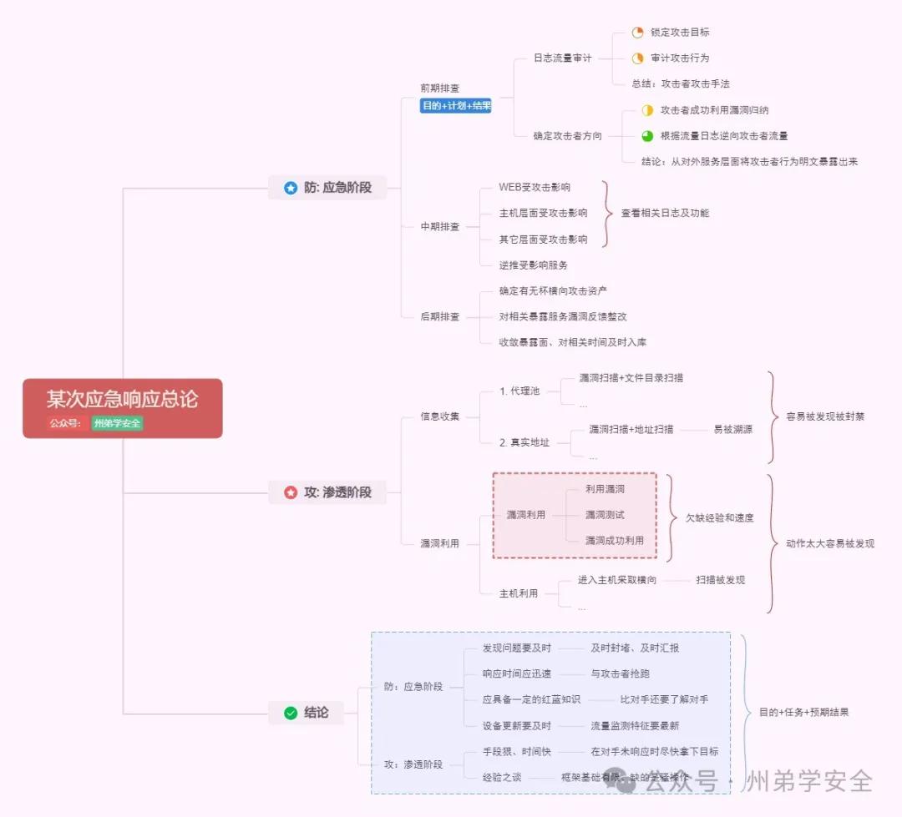

## 十、Phobos 勒索病毒钓鱼邮件与解密

### 环境简介

该环境模拟由钓鱼邮件引发的 Phobos 勒索病毒 2700 变种攻击。用户 `Solar` 点击伪装成“发票.zip”的附件后，计算机被感染，文件遭到加密。

练习重点包括：

- 检查 Foxmail 邮件源码和头部信息，分析邮件来源。
- 提取附件样本，通过授权云沙箱分析网络行为和 C2 地址。
- 识别 Phobos 2700 家族并寻找对应解密工具。
- 在无法完全解密时，从 `C:\Users\Solar\Desktop\工具\backup` 等备份目录恢复数据。

### 访问与资料

- 在线环境：进入 [青少年 CTF 靶场](https://www.qsnctf.com/)。
- 离线环境（夸克网盘）：[下载环境](https://pan.quark.cn/s/487fc06fbcd1)，本地硬盘建议剩余空间大于 30 GB。
- 登录账号：`solar/Solar521`。
- 相关文章：[变种勒索病毒仿真靶场](https://mp.weixin.qq.com/s/k7psP3s4srrMuobflcJ9Ug)。

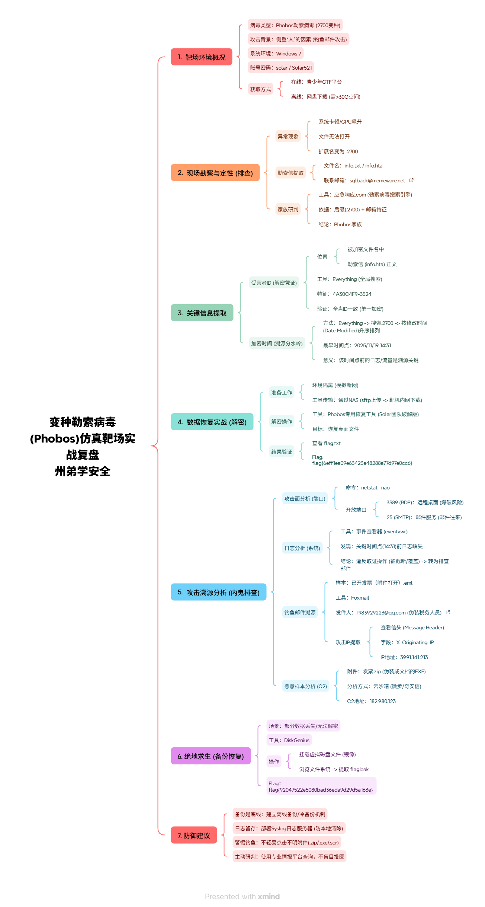

## 十一、DMZ 区 Windows/Linux 联动排查

### 环境简介

该环境模拟生产区与测试区未严格隔离的网络。攻击者以 DMZ 区 Windows Server 2019 为入口，利用 IIS 上 Ueditor `.NET` 版本历史任意文件上传漏洞上传 WebShell，再通过内网扫描横向移动到 Ubuntu 主机。

机器 1（DMZ1，Windows Server 2019）的练习重点包括：

- 审计 IIS 日志，定位 Ueditor 文件上传攻击。
- 分析 Windows Defender 事件 ID `1116`、`5001`，还原 WebShell 被查杀和 Defender 被关闭的时间线。
- 提取并分析哥斯拉 WebShell，梳理连接密钥等线索。
- 分析安全日志，定位隐藏账户 `$system` 和 RDP 登录行为。
- 通过 Amcache、ShimCache 追踪已经删除的 fscan、frp 等工具。

机器 2（DMZ2，Ubuntu）的练习重点包括：

- 根据 DMZ1 的扫描线索排查 Nacos 未授权访问或弱口令问题。
- 分析 Nacos 配置泄露导致的 SSH 凭据失陷。
- 定位 UID 为 0、家目录伪装为 `/var/tmp/.sys` 的特权隐藏账户 `sys-update`。
- 清理恶意账号、修复 Web 漏洞并停止高风险服务。

### 访问与资料

- 在线环境：访问 [青少年 CTF](http://qsnctf.com/)，下载题目附件后在线解题。
- 离线环境（百度网盘）：[下载环境](https://pan.baidu.com/s/1kM2ojRM7QvsZvwbejqE4gQ)，提取码：`ek24`。
- 离线环境（夸克网盘）：[备用下载](https://pan.quark.cn/s/51fb78ad3ac1)。
- 解压密码：`HHsolar88*90`。
- Windows：`administrator/Solarsec521`。
- Ubuntu：`root/Solarsec521`。
- 相关文章：[DMZ 区攻防场景与排查思路](https://mp.weixin.qq.com/s/3PjV7WIAM1C7Yu7cSLqUcA)。

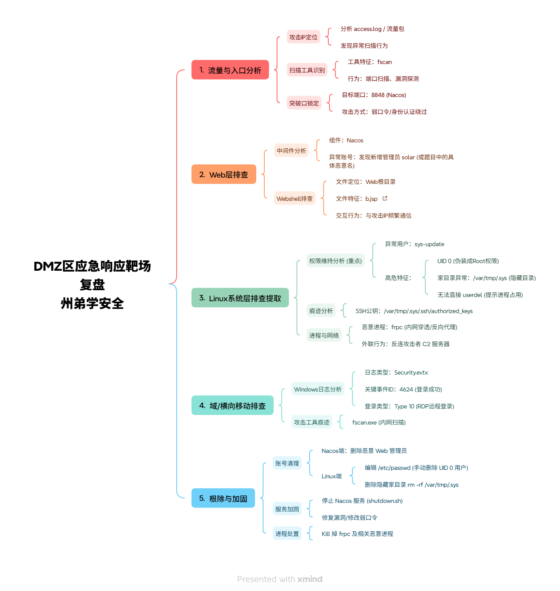

## 十二、恶意浏览器插件窃密与远控溯源

### 环境简介

该环境模拟恶意浏览器插件进行网络监控和敏感数据窃取，并通过伪造系统弹窗诱导用户下载后续远控木马的事件。排查从安全设备捕获的可疑外联 IP `47.105.126.219` 开始，要求串联完整攻击链。

练习重点包括：

- 使用火绒剑等工具，从异常外联定位发起连接的 `chrome.exe`。
- 使用 Chrome 任务管理器（`Shift+Esc`）识别异常 Service Worker，提取插件 ID 和存储路径。
- 分析 `background.js` 等文件属性，确定恶意插件落地时间。
- 使用 HackBrowserData 提取 Chrome SQLite 下载记录，定位 `extension.zip` 的初始来源。
- 审计 `content.js`、`background.js`，分析钓鱼页面注入、LocalStorage 窃取和公网 IP 查询行为。
- 分析“运维助手.exe”等诱导下载的远控样本，通过动态行为和网络监控定位 C2 基础设施。

### 访问与资料

- 在线环境（玄机）：[挑战 441](https://xj.edisec.net/challenges/441)。
- 在线环境（青少年 CTF）：[靶场模块](https://www.qsnctf.com/#/main/target)。
- 离线环境（百度网盘）：[下载环境](https://pan.baidu.com/s/1jHrVWDZRp776ra7k53n41w?pwd=imbf)。
- 离线环境（夸克网盘）：[下载环境](https://pan.quark.cn/s/22c990460265)。
- Windows 主机：`solar/Solar2026`。
- 相关文章：[恶意浏览器插件窃密与远控溯源复盘](https://mp.weixin.qq.com/s/hLIdSswvBCukt2qsKUPBfA)、[Solar 应急响应公益月赛题解](https://mp.weixin.qq.com/s/2mnpzKlVuQi-AhszjZ642Q)。

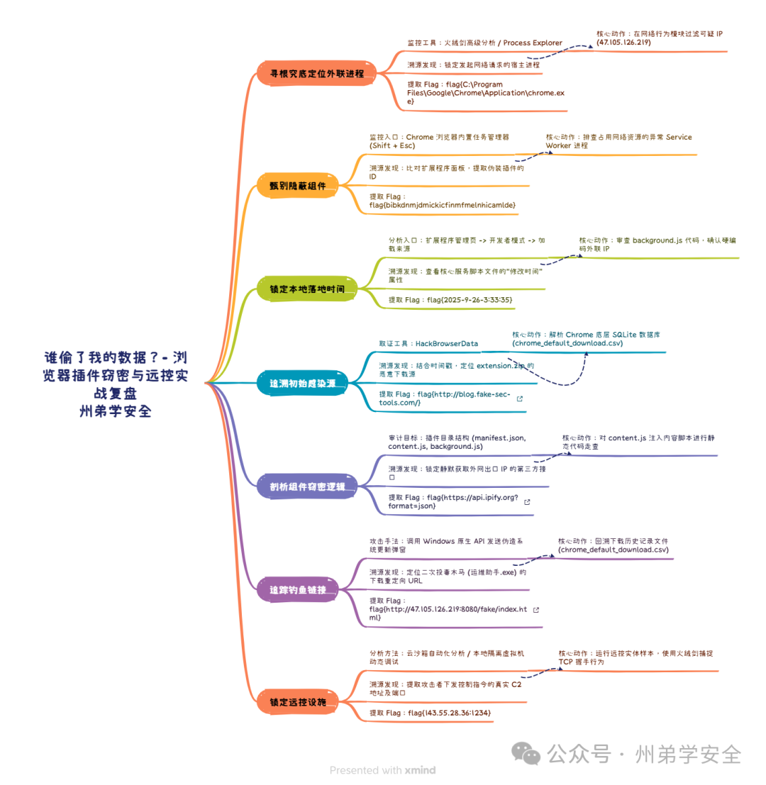

## 推荐练习方法

1. **先建立基线**：记录系统版本、主机地址、开放服务、正常进程和正常网络连接。
2. **先做证据清单**：明确需要采集的日志、内存、进程、网络连接、文件和账号信息。
3. **从时间线开始**：把告警、登录、进程启动、文件落地、网络连接和清理动作按时间排序。
4. **主机与流量互证**：不要只依赖单个日志或单个 IP，用主机痕迹和流量证据相互验证。
5. **区分验证与利用**：训练重点是确认攻击链和修复根因，使用无害验证，不扩大数据读取范围。
6. **最后输出报告**：至少说明事件概述、影响范围、攻击路径、证据、处置过程、根因和加固建议。

## 版权与资料来源

本合集来源信息如下：

- 思而听（山东）网络科技有限公司。
- Solar 应急响应团队。
- 州弟学安全。

下载链接、训练环境和相关文章的版权归原作者或对应平台所有。本页面仅作学习导航和资料整理使用，使用前请确认相关授权、平台规则和资源有效性。
