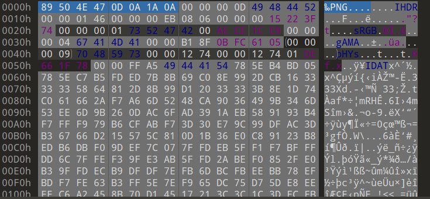

# PNG文件修复

## Header

在header部分中，我们可以看到，PNG是由

```text
89 50 4E 47 0D 0A 1A 0A
```
因此有时会进行删除PNG的文件头，在Windows中会出现无法打开的现象，在Linux环境中，会出现`读入PNG图像文件时发生严重错误：Not a PNG file`的字样

修复流程，我们需要在16进制编辑器里面，例如WinHex或010editor中插入文件头数据即可。



## IHDR

在PNG中，IHDR部分存在着重要的信息，它定义了图像最基础、最核心的属性，没有它，解码器就无法正确地解析和显示图像。

每个数据块（Chunk）都由四部分组成：

+ 长度： 4 字节，表示数据域的长度。

+ 块类型： 4 字节，用 ASCII 码表示。IHDR 就是它的类型码。

+ 数据域： 存储块的实际数据。

+ CRC： 4 字节，用于校验块数据的完整性。

对于 IHDR 块，其数据域固定为 13 字节，包含了以下关键信息：

IHDR 数据域的详细解析（13字节）
这 13 字节按顺序定义了图像的 7 个核心属性：

1. 宽度： 4 字节
```text
含义： 图像的像素宽度。

范围： 1 到 (2^31 - 1)。这是一个无符号的大端序整数。

重要性： 告诉解码器图像有多宽，以便按行处理像素数据。
```
2. 高度： 4 字节
```text
含义： 图像的像素高度。

范围： 1 到 (2^31 - 1)。同样是无符号大端序整数。

重要性： 告诉解码器图像有多高，确定总像素数和数据流的结束位置。
```
3. 位深度： 1 字节
```text
含义： 每个颜色通道用多少位（bit）表示。

常见值：

1， 2， 4， 8， 16

对于索引色图像（调色板模式），可以是 1, 2, 4, 8。

对于灰度或真彩色图像，通常是 8 或 16。

重要性： 决定了图像的色彩精度。例如，位深度为 8 表示每个通道有 256 级强度。
```
4. 颜色类型： 1 字节
```text
含义： 定义图像的色彩模型。

关键值：

0： 灰度图像。

2： 真彩色图像（RGB，三个通道）。

3： 索引色图像（使用 PLTE 调色板）。

4： 带Alpha通道的灰度图像（灰度+透明度）。

6： 带Alpha通道的真彩色图像（RGBA，四个通道）。

重要性： 它决定了后面 IDAT 数据流中每个像素由几个“样本”组成。例如，类型 2（RGB）是3个样本/像素，类型 6（RGBA）是4个样本/像素。
```
5. 压缩方法： 1 字节
```text
含义： 图像数据（IDAT块）使用的压缩算法。

目前有且仅有 0： 表示使用 Deflate/Inflate 压缩算法（与 ZIP/gzip 同族）。

重要性： 所有合规的 PNG 解码器都必须支持此方法。
```
在上述高宽中，出题人可能会进行修改高宽的数值，然后造成一系列的影响，如果修改高度，会出现图片"缩短"的现象，导致下方的图片无法显示。

如果宽度的改变，则会出现图片混乱的现象，因为在原本的图片中，图片的显示是根据原始的宽度进行填充的，如果进行缩短的了宽度，原本一行要填充的像素会在修改之后的图片无法完全填充，以至于多余的像素转到下一行，从而导致图片混乱。

当然在如果修改任意的一个数值，会重新计算CRC值，因此会和原始的IHDR中的CRC不同，换句话说，我们可以根据图片IHDR的CRC进行计算，然后判断，图片的高宽是否发生改变。

脚本如下：

```python
import zlib
import struct
import argparse
import itertools


parser = argparse.ArgumentParser()
parser.add_argument("-f", type=str, default=None, required=True,
                    help="输入同级目录下图片的名称")
args  = parser.parse_args()


bin_data = open(args.f, 'rb').read()
crc32key = zlib.crc32(bin_data[12:29]) # 计算crc
original_crc32 = int(bin_data[29:33].hex(), 16) # 原始crc


if crc32key == original_crc32: # 计算crc对比原始crc
    print('宽高没有问题!')
else:
    input_ = input("宽高被改了, 是否CRC爆破宽高? (Y/n):")
    if input_ not in ["Y", "y", ""]:
        exit()
    else: 
        for i, j in itertools.product(range(4095), range(4095)): # 理论上0x FF FF FF FF，但考虑到屏幕实际/cpu，0x 0F FF就差不多了，也就是4095宽度和高度
            data = bin_data[12:16] + struct.pack('>i', i) + struct.pack('>i', j) + bin_data[24:29]
            crc32 = zlib.crc32(data)
            if(crc32 == original_crc32): # 计算当图片大小为i:j时的CRC校验值，与图片中的CRC比较，当相同，则图片大小已经确定
                print(f"\nCRC32: {hex(original_crc32)}")
                print(f"宽度: {i}, hex: {hex(i)}")
                print(f"高度: {j}, hex: {hex(j)}")
                exit(0)

```

## IDAT

PNG的图像数据块（IDAT）存储图像的实际数据，相当于BMP图像的图像数据，由于PNG可包含多幅图像，所以PNG的图像数据块可能是一副图像的数据组成，也可能是多幅图像的数据组成。

如果图片过小，可能一个IDAT块都会装不下，因此在十六进制编辑器里面，只会存在一个IDAT块。

并且在IDAT中，每一个IDAT块都存在一个CRC的值，因此计算每一个块的CRC大小，即可判断IDAT块是否发生改变。

修改方面：
使用`png-debugger`可以进行判定，该工具会给出每一个块的正确的CRC值。
