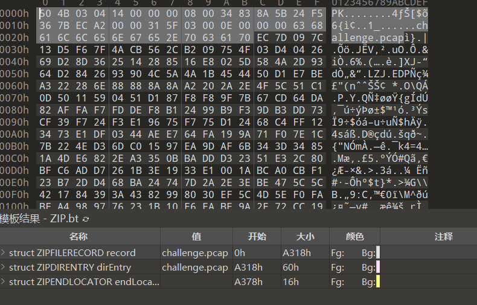

# ZIP文件修复

对于ZIP来说，它的十六进制还是比较容易看明白的。

如图所示：



通常我们要去修复的只有它的文件头，一般出题人会去骚乱它的文件头，例如将文件头进行删除，或者将原本的文件头`50 4B 03 04`改变为`50 4B 04 03`这样就会在打开压缩包的时候出现分卷的问题。

还有一种方式我们后面会讲到，也就是有关压缩包的伪加密，将原本没有加密的压缩包，转化为加密过后的压缩包。

总的来说，对于全部的文件都会出现一种情况，文件进行逆序，文件的十六进制逆序存放，这里给出解题脚本。

```python
f = open('challenge', 'rb').read()
res = open('challenge1', 'wb')
res.write(f[::-1])
```
