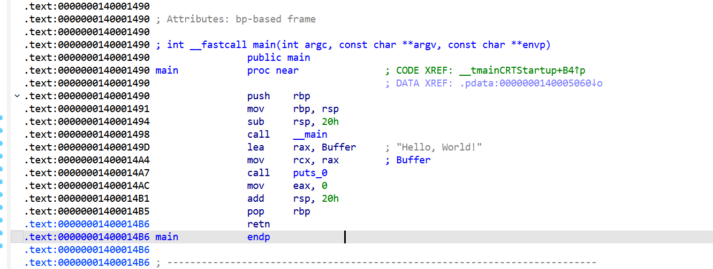

## IDA-View 反汇编视图

**IDA-View** 是 IDA Pro 的核心工作窗口之一，也是逆向工程师花费时间最多的界面。它本质上是 IDA 展示程序反汇编结果的主视图，负责以可读形式呈现二进制代码的结构、逻辑与数据布局，是整个静态分析流程的中心。

从功能上看，IDA-View既是**代码展示窗口**，也是**交互式分析界面**，用户不仅可以“看”代码，还可以在其中进行大量操作，如重命名函数、添加注释、修改类型、划分代码与数据、跳转调用关系等。


IDA-View 主要提供两种视图模式，可通过**空格键（Space）**在二者之间切换。

### 默认视图：Graph View

默认情况下，IDA-View 以**控制流图（Control Flow Graph, CFG）**的形式展示函数。

在这种模式下：

- 每个函数被拆分为多个**基本块（Basic Block）**
- 每个基本块表示一段**顺序执行的指令序列**
- 基本块之间通过**箭头连线**表示跳转关系，如：
  - 条件跳转（if/else）
  - 循环结构（while/for）
  - switch 分支

优点：

- 直观呈现程序逻辑结构
- 便于理解分支、循环、异常处理等控制流
- 有助于快速定位关键逻辑路径

典型应用场景：

- 分析条件判断（if/else）
- 研究算法流程
- 追踪函数执行路径
- 逆向关键逻辑模块

对于复杂函数，Graph View 往往比线性汇编更容易理解。

### Text View（线性文本视图）

> “点击空格即可切换”



## **IDA-View 中每一行的含义**

在 IDA-View 里，一行典型反汇编代码通常包含以下部分：

```
.text:0000000140001000 push rbp
```

可以拆解为：

1. **段名（Segment）**：`.text`
    表示该指令位于代码段
2. **地址（Address）**：`0000000140001000`
    表示该指令在虚拟内存中的位置
3. **指令（Instruction）**：`push rbp`
    真正的汇编操作

IDA 会自动区分：

- 代码（Code）
- 数据（Data）
- 未定义区域（Undefined）

并用不同颜色或格式进行区分。

------

## **IDA-View 可进行的核心操作**

在 IDA-View 中，你可以直接进行大量逆向操作，例如：

### **1. 重命名函数与变量**

右键某个函数名（如 `sub_401000`）→ Rename
 可以改成：

```
sub_401000 → main
```

这对提升可读性非常重要。

------

### **2. 添加注释**

你可以：

- 在指令上添加行内注释
- 在函数开头添加整体注释

例如：

```
push rbp   ; 保存栈帧
```

这对写博客、做笔记或分享分析非常有用。

------

### **3. 切换代码/数据**

如果 IDA 误判某段数据为代码，你可以手动修正：

- 右键 → Make Data
- 或 Make Code

这是逆向过程中非常常见的操作。

------

## **IDA-View 与其他窗口的关系**

IDA-View 并不是孤立存在的，它与多个窗口联动：

- **Function Window**：
   你在函数列表中双击某函数，IDA-View 会自动跳转到对应位置。
- **Hex View**：
   你在 IDA-View 选中某地址，Hex View 会同步定位到相同内存区域。
- **Structures / Enums**：
   你可以在 IDA-View 中将某块数据应用为结构体，自动格式化显示。