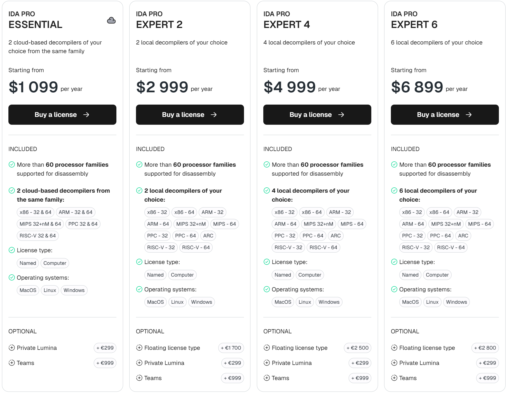
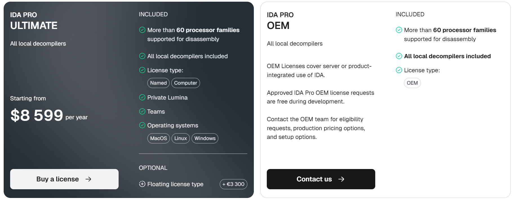
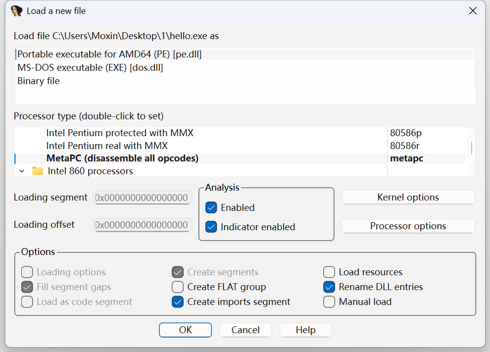
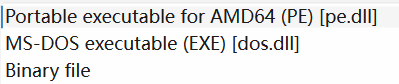
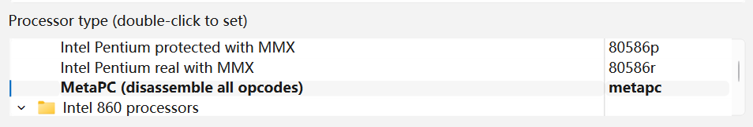
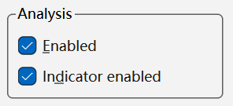

## IDA Pro 介绍

IDA Pro（Interactive DisAssembler Professional）是由 Hex-Rays 公司开发的一款交互式反汇编与逆向分析工具，也是目前软件逆向工程领域应用最广泛的静态分析平台之一。它能够将二进制程序反汇编为汇编代码，并提供丰富的交互功能，帮助研究人员理解程序结构、分析逻辑流程和识别关键功能模块。

需要注意的是，IDA Pro 属于商业付费软件，其主程序与不同处理器架构的反编译插件分别授权收费。用户需根据自身需求，在 Hex-Rays 官方网站购买相应的许可证后方可合法使用。






此外，Hex-Rays 公司还推出了基于云端分析引擎的免费逆向工具 **IDA Free**，但目前仅支持 x86 架构的反汇编与分析。

## IDA基础

> 其他未提及内容，请参考官方文档：https://docs.hex-rays.com/getting-started/install-ida
>
> 由于篇幅限制，不额外赘述。

!!! question "提醒"

    在较早版本的 IDA 中，通常会同时提供 ida.exe 和 ida64.exe 两个启动程序，分别用于分析 32 位（x86）和 64 位（x64）可执行文件。因此，在使用 IDA 分析某个二进制程序时，必须根据目标程序的指令集位宽选择对应的启动器。如今的 IDA 已不再采用这种区分方式，只需使用一个统一的启动器即可完成不同架构程序的分析。

### 使用

#### Quick Start页面


这是**IDA Pro 启动时的“快速开始（Quick start）”引导界面**，作用是帮助用户**选择接下来要做什么工作**。
 可以把它理解为 IDA 的“项目入口页”。

你可以理解为

> **你是要新分析一个文件？继 续自己的工作？还是打开之前的分析？**

##### **New — “Disassemble a new file”**

**含义：开始反汇编一个全新的可执行文件**

点击后，你会进入典型流程：

1. 选择要分析的文件（.exe / .dll / .bin / .so / .elf 等）
2. IDA 识别文件格式（PE、ELF、Mach-O 等）
3. 选择 CPU 架构（x86、x64、ARM、MIPS 等，取决于你的插件）
4. IDA 开始自动分析（反汇编 + 代码识别）
5. 进入主界面查看反汇编结果

 **适用场景：**

- 你有一个新的程序要逆向
- 第一次分析某个目标文件
- 做恶意代码分析、漏洞研究、破解分析等

**这应该是你以后最常点击的按钮。**

##### **Go — “Work on your own”**

这个选项**不是去分析文件**，而是：

**进入 IDA 主界面，但不加载任何目标文件**

简单说：

- 打开一个“空白 IDA 工作环境”
- 你可以：
  - 写 Python 脚本（IDA Python）
  - 测试插件
  - 学习 IDA API
  - 调试 UI
  - 研究数据库结构
  - 开发自动化工具

**适用场景：**

- 开发 IDA 插件
- 学习 IDA 脚本
- 调试自己的逆向工具
- 做研究，而不是分析某个二进制文件
- 稍后再打开一个二进制文件

##### **Previous — “Load the old disassembly”**

**打开你之前分析过的 IDA 数据库（.idb / .i64）**

当你在 IDA 里分析一个文件时，IDA 会保存一个数据库文件：

- 32 位分析 → `.idb`
- 64 位分析 → `.i64`

点击 **Previous** 后，你可以：

- 选择之前的 `.idb / .i64` 文件
- 直接回到你上次的分析状态
- 包含你：
  - 重命名的函数
  - 添加的注释
  - 标记的代码
  - 自定义结构
  - 修改的符号

**适用场景：**

- 你昨天分析了一半，今天继续
- 需要重新查看历史分析结果

### 基础程序演示

使用C语言写一个简单的hello world程序

```c
#include <stdio.h>

int main()
{
    printf("Hello, World!\n");
    return 0;
}
```

编译一下

```bash
gcc .\hello.c -o hello.exe
```

在IDA的`Quick Start`页面选择`New`打开这一编译出的`hello.exe`



这个界面是 **IDA 在正式开始反汇编之前的“装载与识别配置窗口”**，主要做三件事：

1. **告诉 IDA：这是什么类型的文件**
2. **告诉 IDA：目标 CPU 架构是什么**
3. **告诉 IDA：用什么方式加载与分析**

**你可以把它理解为：反汇编的“预处理与参数设置页面”。**

> 如果没有其他需要操作的，我们在这里可以直接点击`OK`进入分析。

比如该程序，`Load file C:\Users\Moxin\Desktop\1\hello.exe as`表示位置在`C:\Users\Moxin\Desktop\1\hello.exe`

#### 文件识别选项



下面还有三个选项，

1. **Portable executable for AMD64 (PE) [pe.dll]  **（当前被选中）

这表示：

- IDA **自动识别出这是一个 Windows 可执行文件（PE格式）**
- 目标平台是 **x64（AMD64）**
- IDA 会使用 **pe.dll 加载器**来解析这个文件

**一般情况下你几乎永远保持默认，不需要改。**

2. **MS-DOS executable (EXE) [dos.dll]**

如果你选择这个：

- IDA 会把文件当作 **老式 16 位 DOS 程序**来解析
- 适用于：
  - 非常古老的 DOS 程序
  - 早期 16 位可执行文件

**对现代 Windows 程序基本不用这个。**

3. **Binary file**

含义：

- 把文件当作**纯二进制数据**
- **不会使用 PE 解析器**
- IDA 不会自动识别函数、段、导入表等

适用于：

- 固件（firmware）
- 嵌入式二进制
- 无格式裸文件
- 自定义加壳文件

**逆向嵌入式设备时会经常用到。**

#### 处理器类型选项



这是**非常重要的一栏**，决定了**反汇编使用哪种指令集**。

默认一般是`MetaPC (disassemble all opcodes)   metapc`

MetaPC 是一种**通用 x86 反汇编模式**：

- 不严格区分 8086 / 386 / 486 / Pentium
- 尽量把**所有 x86 指令都能反汇编出来**
- 兼容性最好，但**不是最精准的模式**

**优点：不容易出错，能处理大多数 x86 代码**

!!! tip "什么时候需要手动更改？"

    如果你非常清楚目标程序是为某一代 CPU 编译的，可以指定更精确的处理器，例如：
    
    - 只想分析老程序 → 选 80386
    
    - 现代程序 → 选 Pentium Pro 或 Core
    
    但一般新手保持 MetaPC 没问题。

#### 加载地址

在左下角：


这决定：**IDA 把程序加载到什么虚拟地址进行分析**

一般情况下：

- **保持默认 0**
- 只有在：
  - 固件分析
  - 嵌入式逆向
  - 非标准二进制
  - 内存镜像分析

时才会手动修改。

#### 分析选项



中间有两个勾选框：

1. **Enabled**

表示：**开启 IDA 的自动分析引擎**

IDA 会自动：

- 识别函数
- 识别代码块
- 识别调用关系
- 识别数据结构

**几乎永远保持勾选。**

2. **Indicator enable**

这是 UI 相关选项：

- 会在 IDA 界面底部显示**分析进度条**
- 告诉你：
  - 分析进行到哪一步
  - 还剩多少

建议：**保持勾选。**

#### 加载选项


##### Loading options（未勾选）

如果勾选：

- IDA 会弹出**更详细的加载配置窗口**
- 适合高级用户精细控制

新手：不用管。

------

##### Fill segment gaps（填充段空隙）

含义：

- 如果程序段之间有空洞（未使用区域）
- IDA 会用数据填充这些空白

作用：

- 让反汇编结构更完整
- 便于可视化分析

一般**建议保持勾选**。

------

##### Load as code segment（未勾选）

如果勾选：

- IDA 会**强制把整个文件当代码解析**
- 可能导致：
  - 把数据当代码
  - 产生大量垃圾指令

**通常不要勾选。**

------

##### Create segments（创建段）

表示：

IDA 会根据 PE 结构自动创建：

- .text（代码段）
- .data（数据段）
- .rdata
- .idata（导入表）

**必须保持勾选**，否则结构会非常混乱。

------

##### Create FLAT group（未勾选）

这是较老的 x86 内存模型选项：

- 主要用于 16 位程序
- 现代 64 位程序几乎用不到

保持不勾选即可。

------

##### Load resources（未勾选）

如果勾选：

- IDA 会加载：
  - 图标
  - 字符串资源
  - 对话框
  - 图片
  - 清单文件

适用于：

- 想分析 UI
- 想提取资源文件

一般分析代码时可不勾。

------

##### Rename DLL entries（重命名 DLL 导入）

表示：

IDA 会：

- 自动把导入函数命名为：
  - MessageBoxA
  - CreateFileA
  - VirtualAlloc
  - ReadFile

而不是：

- sub_401000
- sub_402030

**强烈建议保持勾选。**

------

##### Create imports segment（创建导入段）

IDA 会单独创建：

```
.idata
```

用于存放所有 DLL 导入信息。

**必须勾选，否则分析会很不方便。**

------

##### Manual load（手动加载）

如果勾选：

- IDA **不会自动解析 PE**
- 你需要自己指定：
  - 段
  - 地址
  - 代码区域

> 点击`OK`进入程序

