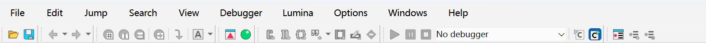
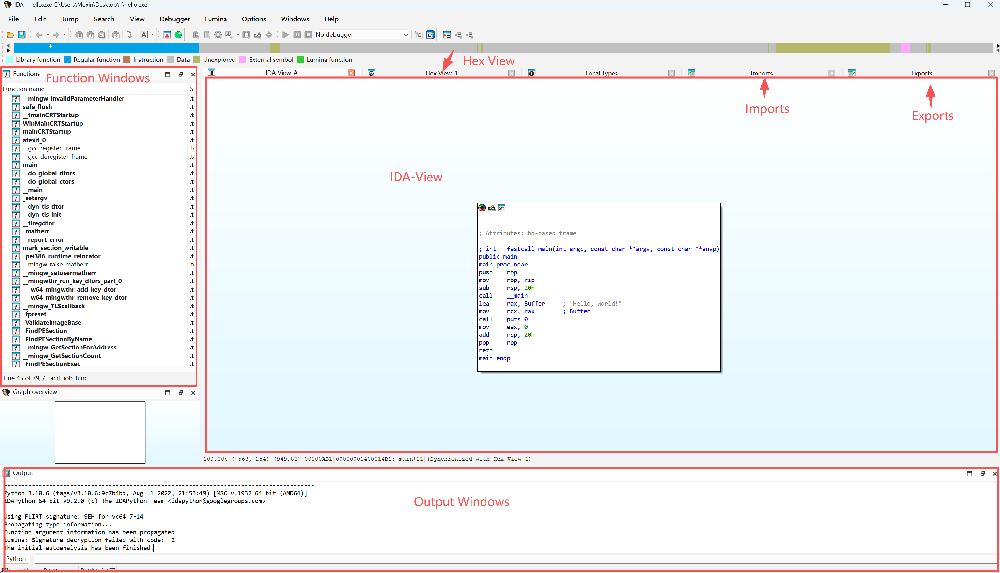

## IDA用户视图

> 以我们在上一篇文章分析的基础程序为例子，为大家介绍一下IDA的用户视图。

### 工具栏

工具栏通常包含：文件、编辑、跳转、查找、视图、调试、Lumina（云端符号数据库与自动识别系统）、选项、窗口、帮助。

- 文件：处理打开和加载二进制文件、导入/导出数据以及生成输出文件。
- 视图：提供快速访问和选项，用于显示和组织视图、图表和工具栏。
- 调试器：提供实时运行、单步执行和分析程序的控制功能。
- Lumina：连接到私有或公共 Lumina 服务，以在不同的二进制文件中共享和检索函数元数据。
- 选项：配置 IDA 的外观、字体、颜色、反汇编首选项等。
- Windows：打开各种工具窗口并管理桌面。
- 帮助：您访问各种帮助资源和许可证管理器的入口。

以下顶级菜单 (1)**会根据您的活动视图**(2) 和光标位置动态更改其内容。

- **编辑**- 提供上下文相关的编辑操作，例如修补字节、修改指令、重命名符号和更改数据类型。
- **跳转** - 导航到二进制文件中的地址、函数、交叉引用和其他位置。
- **搜索**- 在反汇编代码中搜索字符串、模式、指令、常量和引用。

### 主窗口

- **Function Windows（函数窗口）**：展示 IDA 自动识别出的所有函数列表，用户可以通过双击条目快速定位并跳转到对应函数进行查看和分析。
- **IDA-View（反汇编视图）**：以汇编代码形式呈现 IDA 对单个函数的反编译结果。默认以基本块组成的控制流图（Graph View）方式展示函数结构，按下 **空格键** 可切换为线性内存布局的原始汇编视图（Text View）。
- **Hex View（十六进制视图）**：显示二进制文件的原始字节数据，便于直接观察内存布局、数据段内容以及未被识别为代码的区域。
- **Structures（结构体窗口）**：列出 IDA 推断或用户自定义的结构体类型，用于描述程序中复杂的数据布局。
- **Enums（枚举窗口）**：展示 IDA 识别或用户定义的枚举类型，帮助理解数值常量的含义并提升代码可读性。
- **Imports（导入表）**：列出程序运行时从外部模块（如 DLL）引入的函数和符号，例如 Windows API 或其他库接口。
- **Exports（导出表）**：展示该二进制文件对外提供的可调用符号，通常见于 DLL 或共享库文件中。

> 其余正在补充，先写其他的内容了，可以先参考：https://docs.hex-rays.com/user-guide