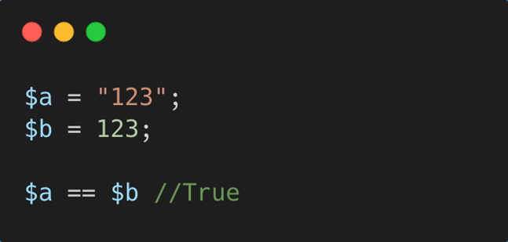

# 关于PHP

关于PHP可以参考：https://docs.qsnctf.com/Code/PHP/

本章内容将不再赘述

## PHP的弱类型

在编程语言中，有一个重要概念：

| 类型       | 含义             |
| ---------- | ---------------- |
| 强类型语言 | 类型必须严格一致 |
| 弱类型语言 | 类型可以自动转换 |

由于PHP是一个弱类型（具体表现在 1.声明变量的时候可以不声明类型；2. 存在隐式类型转换）

### 声明变量的时候可以不声明类型

比如：

```php
$a = 10;
$b = "hello";
$c = 3.14;
$d = true;
```

PHP会自动的判断类型：

| 变量    | 类型   |
| ------- | ------ |
| 10      | int    |
| "hello" | string |
| 3.14    | float  |
| true    | bool   |

这也叫**“动态类型”**

对比强类型语言，比如Java：

```java
int a = 10;
String b = "hello";
```

Java必须写类型，所以Java是强类型语言。

而且PHP会随时更改类型：

```php
$x = 10;
$x = "hello";
$x = true;
```

也就是同一个变量可以变成不同类型，这就是弱类型的重要特征。

### 存在隐式类型转换

PHP在某些情况下会自动把一种类型转换为另一种类型，这叫”隐式类型转换“

比如下面的代码，在计算过程中`$a`会转换成数字类型。

```php
$a = "10";
$b = 5;

echo $a + $b;  // 15
```

PHP 自动转换字符串为数字。

在某些情况下，字符串也会直接参与运算：

```php
echo "10abc" + 5;
```

这将会输出15，因为"10abc" → 10，php会只取前面的数字。



在比较的时候，也会自动进行类型转换。

