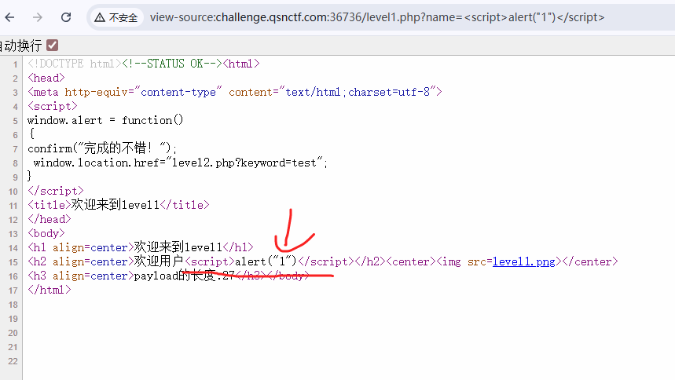
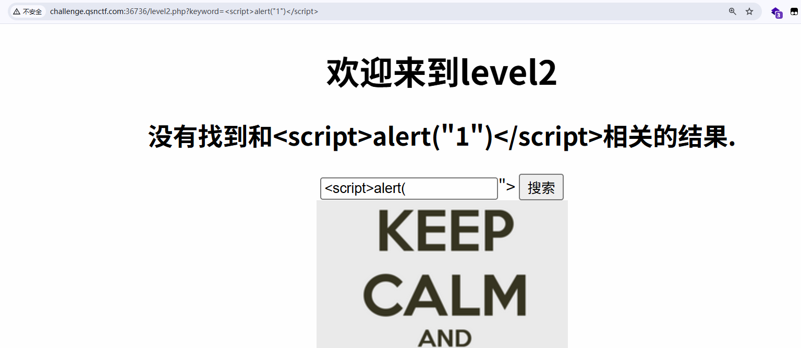
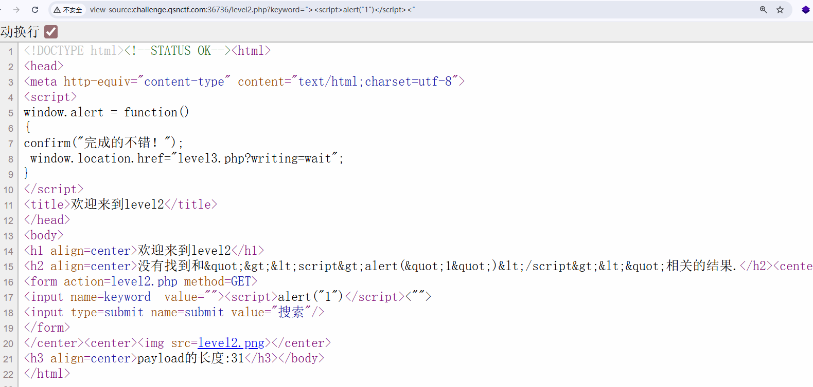
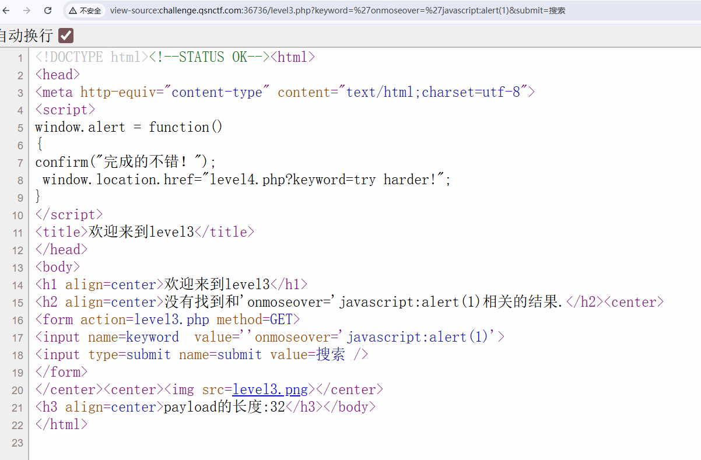
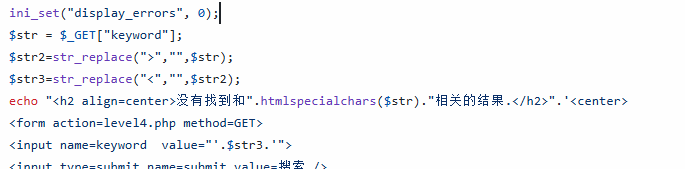
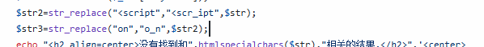

题目地址：https://www.qsnctf.com/#/main/driving-range?page=1&category=15&difficulty=&keyword=&user_answer=&user_favorite=&tag_ids=&challenge_id=23

## 过程


点击中间的图片开始

### Level1


在页面内，发现test，在链接中，发现一个参数，name

name=test

尝试修改test，修改为1234

发现欢迎用户变成1234了

查看网页源码


当我们在地址栏修改name等于`<script>alert("1")</script>`



发现页面是存在html的渲染


### Level2


修改完一个位置，都同时更改了


继续使用上一关的Payload


发现在“没有找到”这个位置的提示是有转义的，将xss的代码转义成了非可执行字符。

但是在input位置，是没有转义的。



回到渲染页面，发现双引号有问题


双引号导致闭合了


双引号的位置可以先提前闭合

```
"><script>alert("1")</script><"
```




### Level3


先随便进行搜索


查看源代码


试试上一关类似的思路，发现都被转义了

这下怎么办呢


单引号是可以的



使用onmouseover的事件

```
'onmouseover='javascript:alert(1)
```

最后一个单引号用原有的单引号即可


### Level4


Level4，先用传统的语句去搜索


应该是去掉了我们的大于号和小于号




用上一关的Payload，改成双引号即可

```
"onmouseover="javascript:alert(1)
```

### Level5


第五关，先用xss祖师爷`<script>alert(1)</script>`试试

发现script变成了scr_ipt



事实上，是替换了<script为<scr_ipt

```
"><a href="javascript:alert(1)">aaa</a><"
```


### Level6

