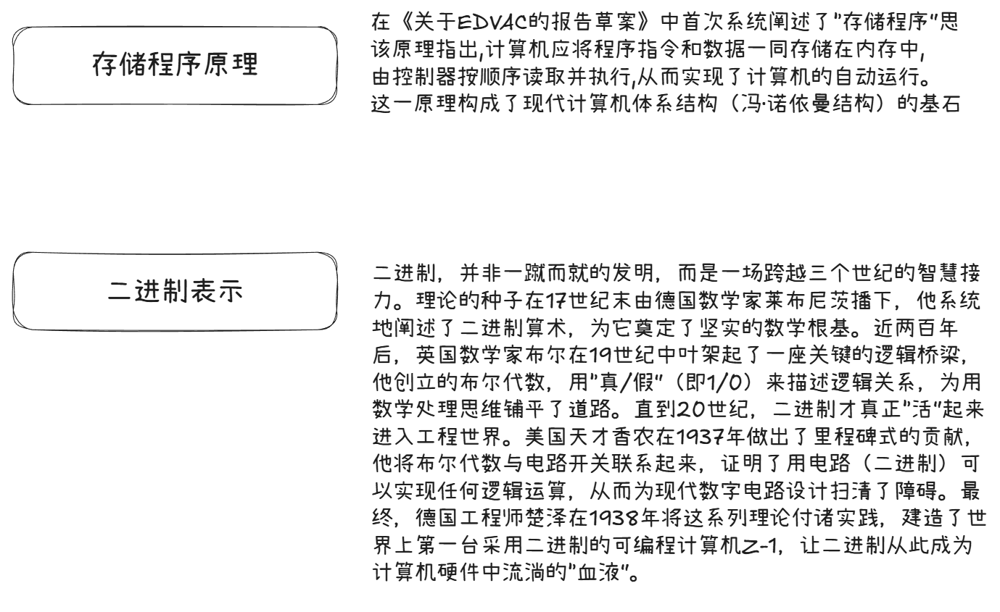
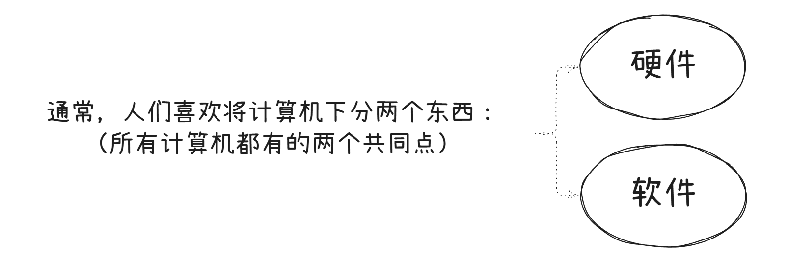

# 计算机是怎么工作的？

## 什么是计算机？

计算机，又称电子计算机，是一种用于 **能够按照程序自动处理信息的电子设备** 。它具备对数据进行存储、检索、运算和处理的能力。在实际应用中，计算机可用于文档编辑、电子邮件通信、信息检索以及网络浏览等基本任务。同时，计算机还广泛应用于电子表格处理、演示文稿制作以及数字音视频的创建与编辑等领域。

不管外形多复杂，**所有计算机本质只做三件事**：

这三大原则共同构成了一个完整的处理循环。例如，当你用键盘（输入设备）敲击按键，CPU（运算器）会处理这个信号，最终在屏幕（输出设备）上显示出对应的字符。

## 两个关键概念

为了让“输入-运算-输出”这个过程能够自动、高效地进行。现代计算机架构还依赖于两个关键概念：

## 两个基础类型

### 硬件：计算机的身体

硬件是计算机系统中所有 **看得见、摸得着** 的物理设备的总称，是软件运行的物理基础。

- **核心定义**：由电子元器件、机械部件等构成的物理实体。

- **主要组成**：

  - **运算器**：负责算术和逻辑运算。

  - **控制器**：指挥协调各部件工作（运算器+控制器=CPU）。

  - **存储器**：存放数据和程序（内存速度快，外存容量大）。

  - **输入/输出设备**：实现人机交互（如键盘、鼠标、显示器）。

### 软件：计算机的灵魂

软件是一系列 **程序、数据和文档** 的集合，它告诉硬件“做什么”和“怎么做”。

- **核心定义**：计算机中非物理形态的指令和数据集合。
- **主要分类**：
  - **系统软件**：管理计算机资源，为应用软件提供支持（如操作系统、数据库管理系统）。
  - **应用软件**：解决特定应用问题，直接面向用户（如办公软件、游戏）。

## 软硬件的关系

**硬件是基础**：没有硬件，软件无法运行。

**软件是灵魂**：没有软件，硬件只是一堆无法工作的“废铁”。

**逻辑等价性**：同一功能既可以用硬件实现（速度快），也可以用软件实现（灵活性高），这是计算机系统设计的重要原则。

## 谁发明了计算机？

计算机的奠基者主要有四位核心人物：

### 艾伦·图灵

### 约翰·冯·诺依曼

### 查尔斯·巴贝奇

