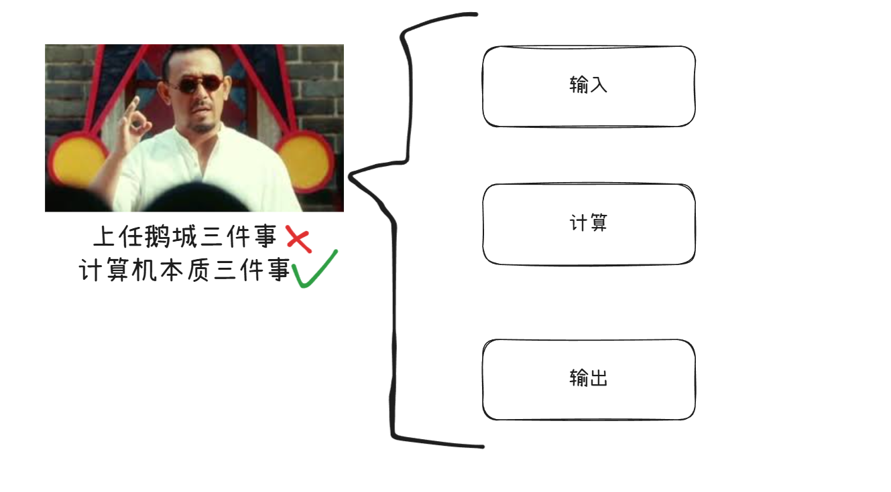

# 计算机是怎么工作的？

## 什么是计算机？

计算机，又称电子计算机，是一种用于**能够按照程序自动处理信息的电子设备**。它具备对数据进行存储、检索、运算和处理的能力。在实际应用中，计算机可用于文档编辑、电子邮件通信、信息检索以及网络浏览等基本任务。同时，计算机还广泛应用于电子表格处理、演示文稿制作以及数字音视频的创建与编辑等领域。

不管外形多复杂，**所有计算机本质只做三件事**：

