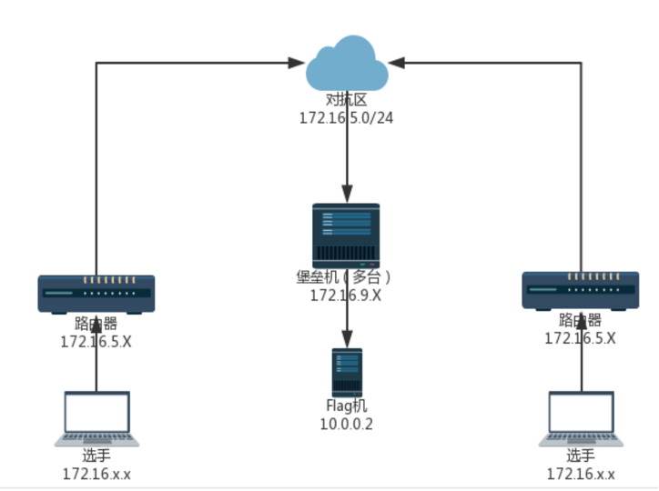

# 什么是CTF？

## CTF的介绍


**CTF（Capture The Flag）中文叫“夺旗赛”**，是一种模拟真实网络攻防场景的竞赛形式。
 参赛者通过分析、逆向、破解、构造 payload、发现漏洞等方式来“夺取”目标系统中的 **Flag（旗子）**，以此得分。它是目前全世界最流行的 **网络安全技术竞赛形式**。

比赛中，主办方会将一个特定的字符串、文件或代码片段（即“Flag”，旗子）秘密地隐藏在预先设置好漏洞的系统、程序或网站中。参赛队伍需要运用专业的安全知识和技术，通过解密、分析、渗透等方式找到这个“旗子”并提交给裁判系统，从而得分。

CTF 比赛不仅考验选手的个人技术水平，也强调团队合作、临场应变和压力下的快速学习能力。

## 旗子是什么？

Flag 是一个“隐藏的秘密字符串”，通常形如：

```
flag{S0m3_RanD0m_Str1nG}
```

当你成功利用漏洞、解密算法或逆向程序后，就能从系统中拿到这个字符串，这表示：

✔ 你成功突破了题目的安全防护

✔ 你完成了挑战

✔ 你获得了得分

## CTF 有哪些比赛形式？

### Jeopardy（解题赛）

解题模式（Jeopardy）常见于线上选拔比赛。在解题模式 CTF 赛制中，参赛队伍可以通过互联网或现场网络参与，通过与在线环境交互或对题目文件进行离线分析，解决网络安全技术挑战并获取相应分值。

这种模式类似于 **ACM 编程竞赛** 或 **信息学奥林匹克竞赛**，根据 **总分与解题时间** 来排名。

简单地说就是，每道题独立解题 → 拿到 Flag → 得分。

#### 🩸 一血 / 二血 / 三血（First Blood 系统）

解题模式下通常会设置：

- **一血（First Blood）**
- **二血（Second Blood）**
- **三血（Third Blood）**

即最先解出该题目的三支队伍会获得额外积分，用于鼓励快速且准确的解题能力。这也是团队整体实力的体现。

#### 📉 降分机制（动态分值）

一些比赛采用所谓的 **降分机制（Dynamic Score）**：

- 题目刚发布时具有较高初始分
- 随着解出该题的队伍变多
- 题目分值逐渐下降
- 最终下降到一个最低保底分

这使得题目难度与得分更加平衡，也增加了比赛的策略性。

#### 📚Jeopardy 题目主要类别

目前 CTF 解题模式主要包含 8 大类别：

- **Web** — 网站与网络攻防
- **Reverse** — 程序逆向分析
- **Pwn** — 二进制漏洞利用
- **Crypto** — 密码学攻击
- **Mobile** — 移动安全
- **Misc** — 其他杂项安全挑战（隐写、取证、奇怪题型等）
- **IOT** — 物联网方向挑战
- **Osint** — 开源情报方向挑战

### AWD（攻防对抗  Attack & Defense）

攻防赛常见于 **线下决赛**，模式真实、激烈、节奏快。

所有参赛队伍会获得一套相同的系统环境，通常称为：`gamebox`（靶机），每个 Gamebox 上运行多个带漏洞的服务。


参赛队伍必须：

- **攻击别人** → 拿 Flag 得分
- **修补自己** → 防止丢分

攻防赛同时比拼：

- 漏洞挖掘能力
- 实时防御能力
- 团队协作

团队之间互相攻防，一边修漏洞、一边攻击其他队伍。（参赛选手既是一个hacker，又是一个manager）

> 一般情况下，主办方会提供网线，但并不会提供网线转接口，对于部分使用没有 RJ45 网口的笔记本设备的选手而言，其通常需要自行准备转换器。

#### Attack & Defense 基本规则


- 战队初始分数均为指值分。
- 比赛以指定时间段（通常为 5/10 分钟）为一个回合，每回合主办方会更新已放出服务的 Flag。
- 每回合内，一个战队的一个服务被渗透攻击成功（被拿 Flag 并提交），则扣除一定分数，攻击成功的战队平分这些分数。
- 每回合内，如果战队能够维护自己的服务正常运行，则分数不会减少（如果防御成功加分则会加分）。
- 如果一个服务宕机或异常无法通过测试，则可能会扣分，服务正常的战队平分这些分。往往服务异常会扣除较多的分数。
- 如果该回合内所有战队的服务都异常，则认为是不可抗拒因素造成，分数都不减少。
- 每回合内，服务异常和被拿 Flag 可以同时发生，即战队在一个回合内单个服务可能会扣除两者叠加的分数。
- 禁止队伍使用通用防御方法。
- 请参赛队伍在比赛开始时对所有服务进行备份，若因自身原因导致服务永久损坏或丢失，无法恢复，主办方不提供重置服务。
- 禁止对赛题以外的比赛平台发起攻击，包括但不限于在 gamebox 提权 root、利用主办方平台漏洞等，违规者立刻被取消参赛资格。

#### 网络环境

一般AWD比赛在开始前会给选手同步文档，你需要根据主办方提供的文档熟悉环境，文档上一般都会有比赛环境的 **网络拓扑图** （如下图），每支队伍会维护若干的 **Gamebox（己方服务器）** ，Gamebox 上部署有存在漏洞的服务。

##### 拓扑结构1



##### 拓扑结构2


##### 拓扑结构3


##### 拓扑结构4

