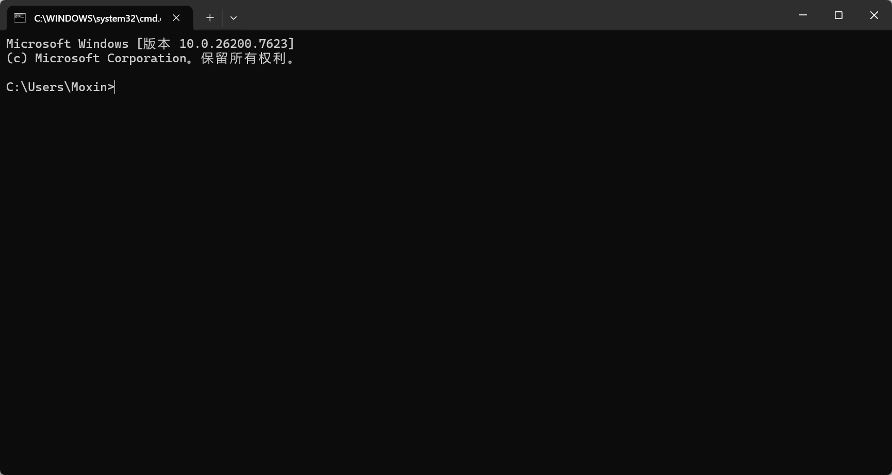
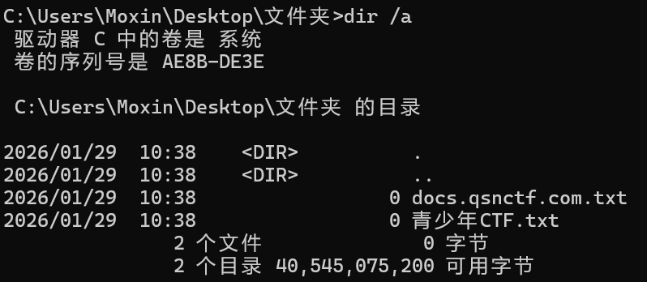

## 什么是操作系统？

操作系统（Operating System，简称 **OS**）是计算机系统中最基本、最核心的软件，它起到 **管理硬件资源和提供应用程序运行环境** 的作用。

### **1. 功能角度**

操作系统是 **管理和协调计算机硬件与软件资源的系统软件** 。它负责：

1. **硬件管理**：CPU、内存、硬盘、外设等。
2. **进程管理**：创建、调度、终止程序执行。
3. **存储管理**：文件系统、磁盘空间分配。
4. **设备管理**：驱动外设、输入输出控制。
5. **用户接口**：提供命令行或图形界面，方便用户操作计算机。

------

### **2. 系统角度**

操作系统是 **介于硬件与应用程序之间的桥梁** ：

- 硬件提供原始计算能力和物理资源。
- 操作系统把这些资源抽象化、统一化，让应用程序不必直接操作硬件。
- 应用程序通过操作系统调用（system call）使用硬件功能。

------

### **3. 抽象角度**

操作系统可以看作 **“资源管理器”** 或 **“虚拟机”** ：

- **资源管理器**：高效分配 CPU 时间、内存空间、外设等资源。
- **虚拟机**：给应用程序提供一个统一、简化的运行环境，使程序运行与底层硬件无关。

### 简明定义

> 操作系统是管理计算机硬件与软件资源，为用户和应用程序提供统一、方便的运行环境的系统软件。

## 操作系统的分类


### 1.按用户分类

**桌面/个人电脑操作系统（PC）**

- Windows（如 Windows 10、11）
- macOS（苹果电脑）
- Linux 桌面版（如 Ubuntu、Fedora、Debian）

**移动设备操作系统**

- Android
- iOS
- HarmonyOS（华为）
- KaiOS（功能机常用）

### 2.按内核类型分类

- **单内核/宏内核（Monolithic kernel）**
  - Linux、Windows NT 内核
- **微内核（Microkernel）**
  - QNX、Minix、L4 系列
- **混合内核（Hybrid kernel）**
  - Windows NT、macOS 的 XNU 内核

### 3.按使用场景分类

**服务器操作系统**

- Windows Server、Ubuntu Server、Red Hat Enterprise Linux

**嵌入式操作系统**

- FreeRTOS、VxWorks、RTEMS

**实时操作系统（RTOS）**

- 用于航空航天、工业控制，如 QNX、RTEMS

**分布式操作系统**

- 如 Google Fuchsia、Plan 9

### 4.按授权方式分类

**专有/商业操作系统**

- Windows、macOS、iOS

**开源操作系统**

- Linux、FreeBSD、OpenBSD、Android（AOSP 版本）

## Windows系统命令

在Windows下，按下【Win徽标键】+【R】可以打开运行窗口，输入程序名称可以快速打开。


如上图所示，输入CMD后回车，即打开了命令提示符。



### cd命令（通用）

`cd` 是 **change directory（切换目录）** 的缩写，用于在 **命令行**（Linux、Mac、Windows 的命令提示符/PowerShell）中切换当前工作目录。

```bash
cd [目录路径]
```

可以使用“绝对路径”、“相对路径”及一些快捷方式。

#### 绝对路径

> **绝对路径** 是从根目录（如Windows下是C:\、Linux和MacOS是/）开始，完整描述文件或文件夹位置的路径。它不依赖于当前工作目录，在任何位置都能唯一确定目标。

```bash
cd /home/user/Documents   # Linux/Mac
cd C:\Users\Alice\Documents   # Windows
```

#### 相对路径

> **相对路径** 是以当前工作目录为基准，描述目标位置的路径。它省略了从根目录到当前目录的部分，只描述从当前目录到目标的路径。

```bash
cd Documents   # 进入当前目录下的 Documents 文件夹
cd ../         # 返回上一级目录
cd ../../      # 返回上两级目录
```

#### 快捷方式

`cd ~` → 回到当前用户的主目录

`cd -` → 回到上一次所在的目录

`cd` 或 `cd ~` → 在 Linux/Mac 下也能直接返回用户主目录

#### Windows的特殊情况

Windows 的路径分隔符是反斜杠 `\`，但大部分命令行也支持正斜杠 `/`。

切换盘符需要先输入盘符：

```bash
D:
cd D:\Projects
```

#### 小技巧

!!! note "小技巧"

    使用 `pwd`（Linux/Mac）或 `cd`（Windows）可以显示当前路径。
    
    使用 Tab 键可以 **自动补全文件夹名**，避免拼写错误。

### 查看目录文件

#### dir命令

dir命令是传统Windows命令，在CMD中可用，在PowerShell也是可以用的。

##### 基本用法

```c
dir
```


##### 常用参数

```c
dir /a        # 显示所有文件（含隐藏文件）
dir /w        # 宽格式显示
dir /s        # 递归显示子目录
dir /b        # 仅显示文件名（bare）
```



##### 注意事项

常用参数中，在PowerShell环境下会报错


这是因为`dir` 在 PowerShell 里其实是 `Get-ChildItem`，所以参数完全不一样。

| CMD            | PowerShell                                      |
| -------------- | ----------------------------------------------- |
| `dir`          | `dir / ls / Get-ChildItem`                      |
| `dir /a`       | `dir -Force`                                    |
| `dir /s`       | `dir -Recurse`                                  |
| `dir /w`       | `dir | Format-Wide`                             |
| `dir /b`       | `dir | Select -Expand Name`                     |
| `dir /a /s /b` | `dir -Recurse -Force | Select -Expand FullName` |


#### ls命令

!!! tip ""

    ls命令在 **PowerShell** 中是允许的，但是在PowerShell中，`ls` 里其实是 **别名（alias）**


```powershell
ls
```

等价于👇

```powershell
Get-ChildItem
```


##### 常用用法

```powershell
ls
ls -Force      # 显示隐藏文件
ls -Recurse    # 递归显示
ls *.txt       # 过滤文件
```

#### Powershell与CMD下的查看目录的区别

| 对比点   | `dir`            | `ls`（PowerShell）   |
| -------- | ---------------- | -------------------- |
| 环境     | CMD / PowerShell | PowerShell           |
| 本质     | 内建命令         | `Get-ChildItem` 别名 |
| 输出     | 文本             | 对象                 |
| 支持管道 | ❌（有限）        | ✅                    |
| 适合场景 | 临时查看、老脚本 | 自动化、筛选、脚本   |

#### 一个重要的知识

在PowerShell中：

```powershell
dir == ls == Get-ChildItem
```

它们返回的都是 **同一套对象**，只是名字不同，方便不同习惯的用户（CMD / Linux）。

👴 **老 Windows 用户 / 批处理** → `dir`

🧠 **PowerShell 脚本 / 自动化 / DevOps** → `ls`

🐧 **Linux 用户转 Windows** → `ls`（更顺手）

### 创建目录

#### CMD下的创建目录

```cmd
mkdir test
```

或

```cmd
md test
```


#### PowerShell下的目录创建

**推荐写法：**

```powershell
New-Item -ItemType Directory 你好啊
```


**简写**：

```powershell
mkdir test
md test
```

!!! tip ""

    PowerShell 里的 mkdir / md 是 别名，底层还是 New-Item

**创建多级目录：**

```powershell
mkdir a\b\c
```

### 删除目录

#### CMD下的删除目录

!!! danger "⚠️"

    只能删空目录

```
rmdir test
```

或

```
rd test
```


**删除目录+所有子目录和文件：**

```cmd
rmdir /s test
```

**静默删除：**

```cmd
rmdir /s /q test
```

!!! danger "⚠️"

    属于危险命令，一旦执行就不能撤销。

#### PowerShell 下的删除目录

**默认不能删非空目录：**

```powershell
Remove-Item test
```

**删除目录 + 内容（等价于 `rd /s`）：**

```powershell
Remove-Item test -Recurse
```

**静默删除：**

```powershell
Remove-Item test -Recurse -Force
```

**别名写法：**

```powershell
rm test -Recurse -Force
```

#### CMD vs PowerShell 对照表

| 操作         | CMD                | PowerShell                    |
| ------------ | ------------------ | ----------------------------- |
| 创建目录     | `mkdir test`       | `mkdir test`                  |
| 创建多级目录 | `mkdir a\b\c`      | `mkdir a\b\c`                 |
| 删除空目录   | `rmdir test`       | `Remove-Item test`            |
| 删除非空目录 | `rmdir /s test`    | `Remove-Item test -Recurse`   |
| 强制删除     | `rmdir /s /q test` | `Remove-Item -Recurse -Force` |

#### 高危操作

!!! danger "⚠️"

    一定不要乱用下面命令！！！

```powershell
rm -Recurse -Force *
rmdir /s /q C:\
```

删除前建议先：

```
ls
```

或

```
dir
```